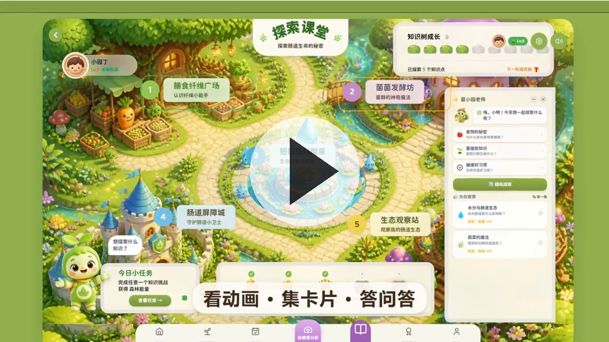

# 肠道花园 · Gut Garden

> 把"肠道微生态"这座看不见的花园，做成孩子能看、能玩、能懂、能养成习惯的互动科普作品。
>
> **科学传播 · 多元艺术表达（AI 驱动）参赛作品**

<div align="center">
  <a href="video/promo.mp4">
    
  </a>
  <br/>
  <sub>🎬 3 分钟宣传片：一个人 + AI = 一套完整科普作品（点击图片播放视频）</sub>
</div>

🔗 **在线演示站（评委可直接体验，无需安装/代理）：** http://124.223.182.140:3001

---

## 一、这是什么作品

你的肠道里住着万亿个微小居民，它们组成了一座花园——这是整个作品的第一句话，也是所有设计的种子。

「肠道花园」是一个面向 0-8 岁儿童的肠道健康科普应用，覆盖比赛的**三类赛道**：

| 赛道 | 对应产出 |
|------|---------|
| 🖼️ 期刊级科普视觉系统 | 20+ 知识卡片、便便分型图、SCFA 链路图、肠道屏障机理图 |
| 🎮 数字交互装置 | 可拖拽玩的花园投喂、便便"天气报告"、AI 导游、成长徽章 |
| 🎬 动态艺术短片 | 90 秒 AI 生成的粘土动画科普片（6 幕叙事） |

三件作品不是拼凑，而是**同一个 IP、同一个科学内核、一套体系**：孩子拖拽食物进花园，看它变绿还是变脏；每天记录"便便天气报告"，系统生成专属饮食任务；坚持打卡，花园从种子长成大树。

---

## 二、我们想传播的科学

**科学问题**：肠道微生态——肠道里的万亿微生物如何影响健康？吃什么会"喂养"哪些居民？为什么医生总说多吃膳食纤维？

难点在于它**看不见**。我们把科学"翻译"成孩子能玩的语言：

> 肠道 = 花园 ｜ 微生物 = 居民 ｜ 食物 = 养分 ｜ 便便 = 花园寄来的天气报告

科学内核（全部有据可依）：
- 膳食纤维是肠道"居民"的食物，食物多样性决定菌群多样性
- 纤维经发酵产生短链脂肪酸（SCFA），是滋养肠道屏障的"魔法养分"
- 饮食单一、熬夜、滥用抗生素会让花园"天气"变差，但每天都可以修复它

这三条知识被做成了完整的**传播闭环**：看 → 玩 → 懂 → 做 → 再验证。孩子不是"被灌输知识"，而是在互动里自己"发现"规律。

---

## 三、核心互动功能

**🍽️ 食物投喂，花园实时变化**
拖拽食物进花园，生态立刻反应：高糖高脂食物 → 坏菌膨胀、场景变暗；纤维种子 + 水分 → 风车转动、花园恢复明亮。孩子 5 秒内就"看见"：吃什么，真的会改变你的微观世界。

**💩 便便"天气报告" → 动态饮食任务**
每天记录便便（7 种布里斯托形态，可选图标或 AI 拍照识别），系统自动解析并生成**专属的今日饮食任务**——数据驱动的个性化科普。

**🤖 AI 导游「菌小园」常驻**
随时可以问："为什么放屁会臭？""酸奶对肠道有好处吗？"回答严格限定在系统知识库内、**绝不编造**，医疗边界清晰。流式打字输出，无网络时自动降级到预设 FAQ。

**🏆 成长与坚持体系**
花园 6 阶段成长（种子 → 幼苗 → … → 终极）、4 类徽章 × 铜银金三级、打卡日历、成长报告仪表盘（12 项指标）。正向强化、断了不惩罚。

**🎓 知识课堂**：膳食纤维广场 / 发酵工坊 / 短链脂肪酸泉 / 肠道屏障城墙 / 生态平衡观测站五大模块，20+ 张"图文摘要"级科学图解，每张正面插画、背面可展开家长模式科学详述。

---

## 四、AI 是如何贯穿全流程的

**AI 不是其中一个功能，而是整个作品的"生产方式"。**

**4.1 AI 造动画**
基于阿里云百炼（ComfyUI + 通义万相 Wan）搭建了一条 AI 视频生产线：90 秒拆成 17 个分镜（结构化 Prompt 存在 JSON），全局"正向+负向提示词"锁定粘土/绒布/粉蓝绿童话色板，5 个主角用 IP-Adapter 保证**全片不换脸**，批量脚本无人值守出片。一个人 + AI，把过去一个动画工作室的活干完了。

**4.2 AI 当导游**
通义千问大模型 + 肠道花园知识库注入，回答只依据知识库；7 条风格规则（花园隐喻开头、先给短结论、结尾给可行动建议、医疗边界清晰）。

**4.3 AI 看懂图**
便便照片上传 → 通义千问 VL 视觉理解 → 识别布里斯托分型 → 生成动态饮食任务。同一套视觉能力还用于**内容质检**（见下）。

**4.4 AI 自修正闭环（加分项）**
生成 → 质检 → 修正 → 人审：AI 出片后用千问 VL 逐帧检查文字拼写、畸变、角色走样、风格漂移，发现问题自动调 seed / 局部重绘 / 续帧回炉，直到通过；人工审片再把审美经验写回提示词库——**系统越用越懂你的风格**。

**4.5 可复用**
"科学内容"与"生成流水线"完全解耦（知识库 = 数据文件、分镜 = JSON 模板、风格 = 角色设定图 + 色板、工作流 = ComfyUI 脚本）。换一个科学主题（免疫、气候、蜜蜂生态……），**一周内可再生产一套作品**。

---

## 五、技术栈

| 层 | 技术 |
|----|------|
| 前端 | React 19 + TypeScript + Vite + Tailwind CSS v4 + Zustand + Framer Motion + @dnd-kit + tsParticles + Howler.js + Lottie |
| 后端 | Fastify + TypeScript + Drizzle ORM |
| 数据库 | PostgreSQL（内置 PGlite 免安装，可选外部实例） |
| AI | 阿里云百炼 · 通义千问 qwen-flash（问答）/ qwen-vl（视觉）/ 通义万相 Wan（视频） |
| 特色 | CSS 3D 四层视差花园 + Lottie 角色动效 + 便便垂直 AI 建议 |

**架构亮点**：单进程托管（Fastify 直接服务前端构建产物 + SPA 回退），一键部署即可对外演示，无需 Nginx；内嵌 PGlite，**零数据库安装**。

---

## 六、在线演示 & 本地运行

### 在线演示（评委）

直接打开 **http://124.223.182.140:3001**，两种方式 30 秒进入：

| 方式 | 操作 |
|------|------|
| 游客体验（最快） | 登录页点「游客体验」→ 输入宝宝名字 → 开始探索 |
| 手机号登录（完整功能） | 切「注册登录」→ 输任意 11 位手机号 → 点「发送验证码」→ 右下角绿色悬浮框抄下 6 位数字 → 登录 |

> AI 对话默认已内置 FAQ 关键词回答；配置真实大模型见下方「环境变量」。

### 本地运行

**环境要求**：Node.js ≥ 20.19（推荐 LTS 22），npm。**无需安装数据库**。

```bash
# ① 启动后端 API（端口 3001）
cd server
npm install
npm run db:migrate   # 首次运行：自动建表 + 写入徽章定义（幂等，可重复执行）
npm run dev

# ② 启动前端（端口 3000）—— 另开一个终端
cd web
npm install
npm run dev
```

浏览器打开 **http://localhost:3000**。

> 生产部署：后端 `cd server && npm run build && npm run start`；前端 `cd web && npm run build`（产物在 `web/dist/`）。也提供了**一键部署脚本** `deploy/server-setup.sh`，详见 `deploy/DEPLOY.md`。

### 环境变量（可选配置）

`cd server && cp .env.example .env`，按需填写：

| 变量 | 用途 |
|------|------|
| `AI_API_KEY`（或 `DASHSCOPE_API_KEY`） | 菌小园 AI 问答（通义千问 qwen-flash 流式回答），在[阿里云百炼控制台](https://dashscope.console.aliyun.com/)创建 API-KEY |
| `STOOL_API_KEY` + `STOOL_API_URL` | 便便拍照视觉分析（可选，不配则用本地规则模拟） |
| `JWT_SECRET` | 登录令牌签名，**生产环境务必改为随机长字符串** |
| `ADMIN_PHONES` | 管理员手机号（逗号分隔），登录后 JWT 带 `role=admin` |
| `PORT` | 后端端口，默认 `3001` |

---

## 七、仓库结构

```
├── server/          # 后端 API（Fastify + PGlite），含 AI 对话/便便分析/打卡/好友等模块
├── web/             # 前端（React 19 + Vite + Tailwind v4）
├── docs/            # 需求/设计文档 + 比赛交流材料 + 建表 SQL
├── deploy/          # 一键部署脚本与在线演示站指南
├── ai-pipeline/     # AI 视频生产线（分镜脚本、提示词、批量出片脚本）
└── scratch/         # 开发调试脚本与截图（非业务代码）
```

## 文档索引

| 文档 | 路径 |
|------|------|
| 比赛交流材料（电梯演讲 / 三类赛道 / AI 全流程） | [docs/gut-garden_比赛交流材料.md](docs/gut-garden_比赛交流材料.md) |
| 业务需求分析 | [docs/00-customer-requirements/](docs/00-customer-requirements/) |
| 产品需求说明书 | [docs/20-prd/gut-garden_产品需求说明书.md](docs/20-prd/gut-garden_产品需求说明书.md) |
| 系统设计 | [docs/30-system-design/gut-garden_系统设计.md](docs/30-system-design/gut-garden_系统设计.md) |
| 建表 SQL | [docs/30-system-design/gut-garden_schema.sql](docs/30-system-design/gut-garden_schema.sql) |

---

我们想证明一件事：**科学传播的下一个时代，不是"把科学画出来"，而是"让每个人都能用 AI 把科学造出来"。**

肠道花园用 AI 造了动画、造了交互、造了一个会自我修正的科普生产系统——让科学，能被看见，能被玩到，能被听懂，能被生产。
