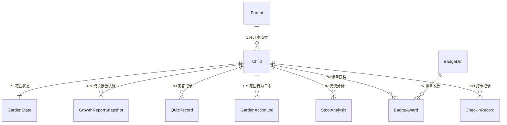

# 03-系统设计：肠道花园（Gut Garden）

> **版本**: v1.0
> **日期**: 2026-07-27
> **平台**: Phase 1 — Web 电脑端
> **团队**: 1 工程师 + 1 美工，2 周 sprint
> **来源**: [gut-garden_产品需求说明书.md](../20-prd/gut-garden_产品需求说明书.md)

---

## §1 架构总览

### 1.1 技术选型

| 层 | 选型 | 理由 |
| ---- | ---- | ---- |
| 前端框架 | **React 18 + TypeScript** | 生态成熟、组件化适合花园交互 |
| 渲染方案 | **CSS 3D Transforms + 视差多层** | 2D 素材通过 CSS `perspective` + `translateZ` + 多层视差滚动模拟 3D 深度感，无需 WebGL/Three.js，美工只需出 2D 图 |
| 2D 动效引擎 | **CSS Animation + Framer Motion** | 声明式 React 动画库，支持弹簧物理、手势拖拽、layout 动画；花园角色移动/弹跳/缩放全用此方案 |
| 精灵动画 | **CSS `steps()` + `@keyframes`** 或 **Lottie (复杂动效)** | 帧动画用 CSS sprite sheet + steps()；角色待机呼吸/庆祝特效等复杂动效导出为 Lottie JSON（美工用 After Effects + Bodymovin 插件） |
| 粒子特效 | **tsParticles** | 轻量粒子库（打卡成功星星、花园花粉飘浮、等级升级光效） |
| 拖拽交互 | **@dnd-kit + Framer Motion** | 食物拖入花园，带磁性吸附和弹性回弹 |
| 微音效 | **Howler.js** | 花园环境音（溪流、鸟鸣）、打卡成功音效、徽章揭晓音效 |
| UI 组件库 | **Radix UI + Tailwind CSS** | 无样式组件基元 + 原子化 CSS，完全自定义视觉风格，不与其他库样式冲突 |
| 状态管理 | **Zustand** | 轻量、TypeScript 友好，适合游戏化状态（花园状态机） |
| 后端框架 | **Node.js + Fastify** | 高性能、TypeScript 原生支持、插件生态好 |
| 数据库 | **PostgreSQL** | JSON 字段支持好（用户徽章快照），全文检索 |
| ORM | **Drizzle ORM** | 类型安全、轻量、migration 自动化 |
| AI 导览 | **OpenAI / Claude API** + 预设 FAQ 兜底 | 大模型直接可用，无需自训 |
| 便便分析 | **第三方 API**（调研 Dieta Health / alternative）| 已有成熟方案，不自训模型 |
| 文件存储 | **本地磁盘 / S3 兼容存储** | MVP 可本地 |
| 缓存 | **Redis**（可选，MVP 可跳过） | 会话管理 |

### 1.2 系统分层

```
┌──────────────────────────────────────────────────┐
│                  浏览器 (Web Desktop)             │
│  ┌───────────────┐ ┌──────────┐ ┌──────────────┐ │
│  │   花园场景     │ │ 打卡页面  │ │  徽章页面    │ │
│  │ CSS 3D +      │ │ React UI │ │  React UI    │ │
│  │ Parallax 视差  │ │ + Tailwind│ │ + Tailwind  │ │
│  │ + Framer Motion│ │          │ │              │ │
│  └───────┬───────┘ └────┬─────┘ └──────┬───────┘ │
│          │               │               │        │
│  ┌───────┴───────────────┴───────────────┴──────┐ │
│  │              Zustand 状态管理                 │ │
│  │   gardenStore / checkinStore / badgeStore     │ │
│  └──────────────────────┬───────────────────────┘ │
└─────────────────────────┼─────────────────────────┘
                          │ HTTP REST + SSE (AI 流式)
┌─────────────────────────┼─────────────────────────┐
│                   Fastify API                      │
│  ┌──────────┐ ┌──────────┐ ┌──────────────┐       │
│  │ 认证模块  │ │ 打卡模块  │ │  徽章模块    │       │
│  │ JWT Token│ │ CRUD+状态│ │  条件引擎    │       │
│  └────┬─────┘ └────┬─────┘ └──────┬───────┘       │
│       │             │              │                │
│  ┌────┴─────────────┴──────────────┴───────┐       │
│  │              Drizzle ORM                 │       │
│  └──────────────────┬──────────────────────┘       │
└─────────────────────┼─────────────────────────────┘
                      │
┌─────────────────────┼─────────────────────────────┐
│                PostgreSQL                          │
│  parents / children / checkin_records /            │
│  stool_analyses / badge_defs / badge_awards ...    │
└───────────────────────────────────────────────────┘
```

### 1.3 前端路由

| 路由 | 页面 | 说明 |
| ---- | ---- | ---- |
| `/` | 首页 | 金刚区 4 按钮 + 3D 花园背景 + 右侧边栏 |
| `/garden` | 探索花园 | 全屏 3D 花园交互（投喂、放大镜、浏览） |
| `/checkin` | 每日打卡 | 任务列表 + 打卡日历 + 便便上传 |
| `/badges` | 成长徽章 | 已获得/待获得徽章 + 花园等级 |
| `/report` | 成长报告 | 家长视图，12 指标仪表盘 |
| `/settings` | 设置 | 儿童档案管理 + 时长限制 |
| `/login` | 登录/注册 | 手机号验证码登录 |

### 1.4 组件树（关键页面）

```
App
├── AuthProvider (JWT 上下文)
├── Layout
│   ├── Sidebar (右侧边栏 — 打卡任务缩略 + 徽章缩略)
│   └── MainContent
│       ├── HomePage
│       │   ├── GardenBackground (3D 轻量背景)
│       │   ├── KingKongZone (4 金刚按钮)
│       │   └── Sidebar
│       ├── GardenPage
│       │   ├── GardenStage (CSS 3D 透视容器, perspective: 1200px)
│       │   │   ├── ParallaxLayer-Back  (天空/远山 — translateZ: -300px, 慢速)
│       │   │   ├── ParallaxLayer-Mid   (蘑菇房/风车/溪流 — translateZ: 0)
│       │   │   ├── ParallaxLayer-Front (角色/食物/植被 — translateZ: 150px, 快速)
│       │   │   ├── Characters (8 个角色 × 2D sprite/Lottie, Framer Motion 位移)
│       │   │   ├── FoodToolbar (底部食物选择栏, CSS flex)
│       │   │   └── MagnifierOverlay (放大镜半透明遮罩, CSS transform 放大)
│       │   │   └── ParticleLayer (tsParticles 花园花粉/水泡/星星)
│       │   └── GardenHUD (状态提示/科普卡片弹出, CSS transition)
│       ├── CheckinPage
│       │   ├── TaskList (3 项任务，含动态"吃好")
│       │   ├── Calendar (月视图打卡日历)
│       │   ├── StoolUpload (便便上传区)
│       │   └── CelebrationModal (打卡成功动画)
│       ├── BadgePage
│       │   ├── BadgeGrid (已获得徽章墙)
│       │   ├── PendingBadges (待获得灰阶预览)
│       │   ├── GardenLevelBar (等级进度条)
│       │   └── BadgeRevealModal (新徽章揭晓动画)
│       ├── ReportPage (家长视图，指标仪表盘)
│       └── SettingsPage (家长控制)
└── AIChatbot (菌小园 — 全局悬浮对话)
```

### 1.5 2D 伪 3D 花园实现原理

**核心思路**: 用多层 2D 插画 + CSS 3D 透视 + 视差滚动，让平面素材产生纵深感。

```
                    用户视角（屏幕）
                         │
    ┌────────────────────┼────────────────────┐
    │  Layer 1: 前景     │ translateZ: 150px  │ ← 角色、食物道具、近处花草
    │                    │ 移动速度: 1.0x     │   鼠标移动时位移最大
    ├────────────────────┼────────────────────┤
    │  Layer 2: 中景     │ translateZ: 0      │ ← 蘑菇房、风车、溪流
    │                    │ 移动速度: 0.5x     │   花园主体建筑
    ├────────────────────┼────────────────────┤
    │  Layer 3: 远景     │ translateZ: -150px │ ← 远山、云朵
    │                    │ 移动速度: 0.2x     │   几乎不动
    ├────────────────────┼────────────────────┤
    │  Layer 4: 天空     │ translateZ: -300px │ ← 天空渐变、太阳
    │                    │ 移动速度: 0x       │   完全静止
    └────────────────────┴────────────────────┘
```

**关键技术**:

| 效果 | 实现方式 | 代码要点 |
| ---- | -------- | -------- |
| 场景纵深感 | CSS `perspective: 1200px` + 各层 `transform: translateZ(n)` | 父容器设 perspective，子元素设不同 translateZ + scale 补偿 |
| 鼠标视差 | `onMouseMove` → 各层反向位移，速度系数不同 | `transform: translateX(Δx * speed) translateY(Δy * speed)` |
| 角色入场/退场 | Framer Motion `animate={{ x, y, scale, opacity }}` | 弹簧物理 `spring: { stiffness: 100, damping: 15 }` |
| 角色待机动画（呼吸） | Lottie 循环 JSON 或 CSS `@keyframes scale(0.98, 1.02)` | 所有角色默认播放 breathing 循环 |
| 角色状态切换 | Lottie 切换或 CSS class 切换 sprite sheet | e.g. 菌小园 idle → worry 切换 Lottie JSON |
| 食物拖拽 | @dnd-kit `useDraggable` + Framer Motion `dragConstraints` | 拖拽区域限定、松手位置检测 |
| 食物投入动画 | Framer Motion `animate` 抛物线路径 + 缩放 + 旋转 | `x: [0, 200], y: [0, -100, 300]` 贝塞尔曲线 |
| 溪流流动 | CSS `@keyframes` 无限水平位移 + `repeat` 背景 | 溪流 PNG 连续平铺，`animation: flow 8s linear infinite` |
| 风车旋转 | CSS `@keyframes rotate` | `animation: spin 4s linear infinite` |
| 花园状态色调变化 | CSS `filter` 过渡 | healthy: none; high_sugar: hue-rotate(-10deg) brightness(0.85); dry: saturate(0.6) |
| 粒子漂浮 | tsParticles `loadFull` | 花园花粉粒子配置（小圆点、缓动、随机方向） |
| 庆祝特效 | Lottie JSON 全屏覆盖 | 打卡成功星星爆炸、徽章揭晓光效 |

**为什么不用 Three.js**:
- 美工不会 3D 建模 → 2D 插画门槛低，出图快
- 2D 伪 3D 在桌面 Web 上性能绰绰有余（CSS transform 走 GPU 合成层）
- 维护成本低：改一张 PNG 即可，不需要重新导模型/调 shader
- 后续小程序端适配更容易（小程序原生就支持 CSS transform）

---

## §2 数据模型

### 2.1 实体关系图



### 2.2 数据库表设计

#### 表清单

| 表名 | 说明 | 预估数据量/用户 |
| ---- | ---- | --------------- |
| `parents` | 家长账号 | 1 行 |
| `children` | 儿童档案 | 1-3 行/家长 |
| `checkin_records` | 每日打卡记录 | 365 行/年/儿童 |
| `stool_analyses` | 便便分析记录 | ~200 行/年/儿童 |
| `badge_defs` | 徽章定义模板 | ~20 行（全局） |
| `badge_awards` | 用户徽章获得记录 | ~50 行/儿童 |
| `garden_action_logs` | 花园行为日志 | ~5000 行/年/儿童 |
| `garden_states` | 花园当前状态快照 | 1 行/儿童 |
| `quiz_records` | 每日问答记录 | 365 行/年/儿童 |
| `growth_report_snapshots` | 成长报告周期快照 | 52 行/年/儿童 |
| `checkin_calendar` | 打卡日历缓存 | 365 行/年/儿童 |

#### 核心表 DDL

**parents** — 家长账号

| 字段 | 类型 | 说明 |
| ---- | ---- | ---- |
| id | BIGSERIAL PK | 主键 |
| phone | VARCHAR(20) UNIQUE NOT NULL | 手机号 |
| created_at | TIMESTAMP DEFAULT NOW() | 注册时间 |
| last_login_at | TIMESTAMP | 最后登录时间 |
| status | VARCHAR(10) DEFAULT 'active' | active/disabled |

**children** — 儿童档案

| 字段 | 类型 | 说明 |
| ---- | ---- | ---- |
| id | BIGSERIAL PK | 主键 |
| parent_id | BIGINT NOT NULL REFERENCES parents(id) | 所属家长 |
| nickname | VARCHAR(30) NOT NULL | 昵称 |
| age | SMALLINT NOT NULL CHECK (age BETWEEN 3 AND 6) | 年龄 |
| daily_limit_minutes | SMALLINT DEFAULT 30 | 每日使用时长限制 |
| created_at | TIMESTAMP DEFAULT NOW() | 创建时间 |

**checkin_records** — 每日打卡记录

| 字段 | 类型 | 说明 |
| ---- | ---- | ---- |
| id | BIGSERIAL PK | 主键 |
| child_id | BIGINT NOT NULL REFERENCES children(id) | 所属儿童 |
| checkin_date | DATE NOT NULL | 打卡日期（服务端 UTC） |
| task_garden | VARCHAR(10) DEFAULT 'pending' | 探索花园：pending/auto_done/manual_done |
| task_eat | VARCHAR(10) DEFAULT 'pending' | 吃好：pending/done |
| task_eat_content | VARCHAR(100) | 动态任务文案（如"今天多吃蔬菜"） |
| task_eat_skipped | BOOLEAN DEFAULT FALSE | 是否被家长跳过 |
| task_eat_skip_reason | VARCHAR(30) | 跳过原因 |
| task_sleep | VARCHAR(10) DEFAULT 'pending' | 睡好：pending/done |
| completed_at | TIMESTAMP | 全部完成时间 |
| is_makeup | BOOLEAN DEFAULT FALSE | 是否为补签 |
| makeup_date | DATE | 补签时对应原始漏签日期 |
| created_at | TIMESTAMP DEFAULT NOW() | — |
| UNIQUE KEY: (child_id, checkin_date) | | |

**stool_analyses** — 便便分析记录

| 字段 | 类型 | 说明 |
| ---- | ---- | ---- |
| id | BIGSERIAL PK | 主键 |
| child_id | BIGINT NOT NULL REFERENCES children(id) | — |
| checkin_id | BIGINT REFERENCES checkin_records(id) | 关联打卡记录 |
| image_url | VARCHAR(500) NOT NULL | 便便照片存储路径 |
| bristol_type | SMALLINT CHECK (bristol_type BETWEEN 1 AND 7) | 布里斯托类型 |
| diagnosis | VARCHAR(100) | 饮食诊断 |
| task_suggestion | VARCHAR(100) | 生成的动态任务文案 |
| api_raw_response | JSONB | 第三方 API 原始响应 |
| uploaded_at | TIMESTAMP DEFAULT NOW() | — |
| is_valid | BOOLEAN DEFAULT TRUE | 是否通过粪便识别验证 |
| expires_at | TIMESTAMP DEFAULT NOW() + INTERVAL '3 days' | 结果有效期 |

**badge_defs** — 徽章定义模板

| 字段 | 类型 | 说明 |
| ---- | ---- | ---- |
| id | BIGSERIAL PK | 主键 |
| code | VARCHAR(50) UNIQUE NOT NULL | 徽章编码（如 `persist_7d`） |
| name | VARCHAR(50) NOT NULL | 徽章名称 |
| category | VARCHAR(20) NOT NULL | 分类：persist/explore/learn/special |
| description | VARCHAR(200) | 徽章描述 |
| condition_rule | JSONB NOT NULL | 获取条件规则 |
| silver_rule | JSONB | 银级升级规则 |
| gold_rule | JSONB | 金级升级规则 |
| sort_order | SMALLINT DEFAULT 0 | 排序 |
| is_active | BOOLEAN DEFAULT TRUE | 是否启用 |

**badge_condition_rule JSON 示例**:
```json
{
  "type": "checkin_streak",
  "threshold": 7,
  "event_source": "checkin.completed"
}
```

**badge_awards** — 用户徽章获得记录

| 字段 | 类型 | 说明 |
| ---- | ---- | ---- |
| id | BIGSERIAL PK | 主键 |
| child_id | BIGINT NOT NULL REFERENCES children(id) | — |
| badge_def_id | BIGINT NOT NULL REFERENCES badge_defs(id) | — |
| rarity | VARCHAR(10) NOT NULL DEFAULT 'bronze' | bronze/silver/gold |
| awarded_at | TIMESTAMP DEFAULT NOW() | 获得时间 |
| upgraded_at | TIMESTAMP | 升级时间 |
| event_id | VARCHAR(100) | 触发行为事件 ID（幂等键） |
| UNIQUE KEY: (child_id, badge_def_id, rarity) | | |
| UNIQUE KEY: (event_id, badge_def_id) — 防重 | | |

**garden_action_logs** — 花园行为日志

| 字段 | 类型 | 说明 |
| ---- | ---- | ---- |
| id | BIGSERIAL PK | 主键 |
| child_id | BIGINT NOT NULL REFERENCES children(id) | — |
| action_type | VARCHAR(30) NOT NULL | feed/explore/magnifier/treatment |
| action_detail | JSONB | 行为详情（投喂食物类型、点击区域等） |
| created_at | TIMESTAMP DEFAULT NOW() | — |
| INDEX: (child_id, created_at DESC) | | |
| INDEX: (child_id, DATE(created_at), action_type) — 每日统计 | | |

**garden_states** — 花园当前状态

| 字段 | 类型 | 说明 |
| ---- | ---- | ---- |
| id | BIGSERIAL PK | 主键 |
| child_id | BIGINT UNIQUE NOT NULL REFERENCES children(id) | — |
| current_state | VARCHAR(20) DEFAULT 'healthy' | healthy/high_sugar/dry/recovering |
| moisture_level | SMALLINT DEFAULT 50 CHECK (moisture_level BETWEEN 0 AND 100) | 水分值 |
| garden_level | SMALLINT DEFAULT 1 | 花园等级 |
| garden_xp | INTEGER DEFAULT 0 | 累计经验值 |
| unlocked_features | JSONB DEFAULT '[]' | 已解锁功能列表 |
| last_updated | TIMESTAMP DEFAULT NOW() | — |

**growth_report_snapshots** — 成长报告周期快照

| 字段 | 类型 | 说明 |
| ---- | ---- | ---- |
| id | BIGSERIAL PK | 主键 |
| child_id | BIGINT NOT NULL REFERENCES children(id) | — |
| period_type | VARCHAR(5) NOT NULL | week/month |
| period_start | DATE NOT NULL | 周期起始 |
| period_end | DATE NOT NULL | 周期结束 |
| metrics | JSONB NOT NULL | 12 项指标值快照 |
| generated_at | TIMESTAMP DEFAULT NOW() | — |
| UNIQUE KEY: (child_id, period_type, period_start) | | |

---

## §3 API 接口设计

### 3.1 接口清单

| 方法 | 路径 | 说明 | 权限 |
| ---- | ---- | ---- | ---- |
| POST | `/api/auth/send-code` | 发送手机验证码 | 公开 |
| POST | `/api/auth/login` | 验证码登录 | 公开 |
| GET | `/api/children` | 获取当前家长的所有儿童档案 | 家长 |
| POST | `/api/children` | 创建儿童档案 | 家长 |
| PUT | `/api/children/:id` | 更新儿童档案 | 家长 |
| GET | `/api/checkin/today?child_id=` | 获取今日打卡状态 | 家长 |
| POST | `/api/checkin/confirm-eat` | 确认"吃好"任务 | 家长 |
| POST | `/api/checkin/confirm-sleep` | 确认"睡好"任务 | 家长 |
| POST | `/api/checkin/skip-eat-suggestion` | 跳过饮食建议 | 家长 |
| POST | `/api/checkin/makeup` | 补签历史日期 | 家长 |
| GET | `/api/checkin/calendar?child_id=&month=` | 获取打卡日历 | 家长 |
| POST | `/api/stool/upload` | 上传便便照片 | 家长 |
| GET | `/api/stool/analysis/:id` | 获取分析结果 | 家长 |
| GET | `/api/stool/latest?child_id=` | 最新分析结果 | 家长 |
| GET | `/api/badges/awarded?child_id=` | 已获得徽章列表 | 家长/儿童 |
| GET | `/api/badges/pending?child_id=` | 待获得徽章列表 | 家长/儿童 |
| GET | `/api/badges/defs` | 徽章定义全量 | 公开 |
| GET | `/api/garden/state?child_id=` | 花园当前状态 | 家长/儿童 |
| POST | `/api/garden/log-action` | 记录花园行为 | 儿童 |
| GET | `/api/garden/actions/today-count?child_id=` | 今日花园交互次数 | 系统 |
| GET | `/api/report/weekly?child_id=&week=` | 周度成长报告 | 家长 |
| GET | `/api/report/monthly?child_id=&month=` | 月度成长报告 | 家长 |
| GET | `/api/badges/awarded?child_id=` | 已获得徽章集合 | 公开 |
| POST | `/api/ai/chat` | AI 导览对话（SSE 流式） | 公开 |

### 3.2 核心接口示例

**POST /api/checkin/confirm-eat**

```json
// Request
{
  "child_id": 1,
  "confirmed": true
}
// Response
{
  "code": 0,
  "data": {
    "checkin_id": 42,
    "task_eat": "done",
    "all_completed": false,
    "remaining_tasks": ["sleep"]
  }
}
```

**POST /api/stool/upload**

```json
// Request (multipart/form-data)
// field: child_id=1
// file: stool_photo.jpg
// Response (同步快返)
{
  "code": 0,
  "data": {
    "analysis_id": 15,
    "status": "processing",
    "estimated_seconds": 15
  }
}
// 分析完成后通过 WebSocket/轮询 更新状态
```

**GET /api/badges/pending?child_id=1**

```json
{
  "code": 0,
  "data": [
    {
      "badge_def_id": 3,
      "code": "persist_7d",
      "name": "一周之星",
      "category": "persist",
      "description": "连续打卡 7 天",
      "current_progress": 5,
      "target": 7,
      "progress_percent": 71,
      "silver_target": 30,
      "gold_target": 100,
      "image_url_bronze": "/assets/badges/persist_7d_bronze.png"
    }
  ]
}
```

---

## §4 业务行为与状态机

### 4.1 花园状态机

```
        ┌──────────────┐
        │   Healthy    │ ← 默认初始状态 (moisture: 40-60)
        │   (健康)     │
        └───┬────┬─────┘
            │    │
   投喂高糖  │    │  投喂干硬+缺水
            ▼    ▼
  ┌──────────┐  ┌──────────┐
  │HighSugar │  │   Dry    │
  │(高糖高脂)│  │ (干旱)   │
  └────┬─────┘  └────┬─────┘
       │              │
  投喂纤维+补水   补水达到阈值
       │              │
       ▼              ▼
  ┌──────────────────────┐
  │     Recovering       │
  │     (恢复中)         │
  └──────────┬───────────┘
             │ 水分平衡 + 排便动画
             ▼
        ┌──────────────┐
        │   Healthy    │
        └──────────────┘
```

### 4.2 徽章条件检测流程

```
用户行为事件 (checkin.completed / garden.action / quiz.answered)
    │
    ▼
BadgeConditionEngine.evaluate(event)
    │
    ├── 查询所有 badge_defs WHERE is_active = true
    ├── 对每个 badge_def:
    │   ├── 检查 condition_rule.type 是否匹配 event.type
    │   ├── 查询该 child 的相关聚合数据 (如连续天数/累计投喂)
    │   ├── 判断是否满足 condition_rule.threshold
    │   ├── 如满足且 badge_awards 中不存在 → 发放铜徽章
    │   ├── 如已获铜且满足 silver_rule → 升级为银
    │   └── 如已获银且满足 gold_rule → 升级为金
    │
    ▼
发放徽章 → 写入 badge_awards → 累积 garden_xp → 检查等级升级 → 推送通知
```

### 4.3 每日重置流程（服务端 cron，凌晨 00:00 UTC）

```
1. 对所有 active children，创建今日 checkin_records (status=pending)
2. 检查 stool_analyses 中 expires_at < NOW() 的记录 → 对应 children 的
   今日 checkin_records.task_eat_content 恢复为默认
3. 聚合昨日数据，生成增量 growth_report_snapshots (如为周期末)
4. 清理过期 token、临时文件
```

### 4.4 关键事务边界

| 操作 | 事务范围 | 说明 |
| ---- | -------- | ---- |
| 确认打卡任务 | 单条 UPDATE + 检查是否全部完成 | 全部完成时触发徽章检测 |
| 便便分析回调 | INSERT stool_analyses + UPDATE checkin_records.task_eat_content | 原子操作 |
| 徽章发放 | INSERT badge_award + UPDATE garden_states.xp | 经验值同步更新 |
| 补签 | INSERT checkin_record (makeup=true) + 重新计算连续天数 | 补签影响连续计数 |
| 等级升级 | UPDATE garden_states.level + INSERT 解锁记录 | — |

---

## §5 徽章条件引擎规则表

### 5.1 条件规则定义（`badge_defs.condition_rule` JSON）

| 条件类型 | JSON 结构 | 示例 |
| -------- | --------- | ---- |
| `checkin_streak` | `{"type":"checkin_streak","threshold":7}` | 连续打卡 7 天 |
| `checkin_total` | `{"type":"checkin_total","threshold":30}` | 累计打卡 30 天 |
| `feed_total` | `{"type":"feed_total","threshold":50}` | 累计投喂 50 次 |
| `magnifier_use` | `{"type":"magnifier_use","threshold":20}` | 放大镜使用 20 次 |
| `quiz_correct` | `{"type":"quiz_correct","threshold":10}` | 累计答对 10 题 |
| `stool_first` | `{"type":"stool_first"}` | 首次便便分析 |
| `perfect_week` | `{"type":"perfect_week"}` | 一周全勤（7/7） |
| `birthday` | `{"type":"birthday"}` | 儿童生日当天登录 |
| `holiday` | `{"type":"holiday","holiday":"spring_festival"}` | 特定节日登录 |

### 5.2 MVP 徽章完整清单（18 枚）

| code | 名称 | 分类 | 铜条件 | 银条件 | 金条件 |
| ---- | ---- | ---- | ------ | ------ | ------ |
| `first_checkin` | 初来乍到 | persist | 首次打卡 | — | — |
| `persist_3d` | 初露锋芒 | persist | 连续 3 天 | — | 连续 7 天 |
| `persist_7d` | 一周之星 | persist | 连续 7 天 | 连续 30 天 | 连续 100 天 |
| `persist_30d` | 月度冠军 | persist | 连续 30 天 | — | 连续 100 天 |
| `persist_100d` | 百日守护 | persist | 连续 100 天 | — | — |
| `first_feed` | 初次投喂 | explore | 首次投喂 | — | — |
| `feed_50` | 小小农夫 | explore | 累计 50 次 | 累计 200 次 | 累计 500 次 |
| `first_magnifier` | 小小科学家 | explore | 首次放大镜 | — | — |
| `magnifier_20` | 放大镜专家 | explore | 累计 20 次 | 累计 100 次 | — |
| `garden_doctor` | 花园医生 | explore | 完成 10 次恢复 | 完成 50 次 | — |
| `first_quiz` | 好奇宝宝 | learn | 首次问答 | — | — |
| `quiz_10` | 答题小能手 | learn | 答对 10 题 | 答对 50 题 | 答对 200 题 |
| `first_stool` | 便便观察员 | learn | 首次便便分析 | — | — |
| `stool_streak_7` | 持续观察 | learn | 连续 7 天分析 | 连续 30 天 | — |
| `type4_streak_5` | 超级便便 | special | 连续 5 次 Type 4 | 连续 15 次 | — |
| `perfect_week` | 完美一周 | special | 7 天全勤 | 4 周全勤 | — |
| `birthday` | 花园生日 | special | 生日登录 | — | — |
| `spring_festival` | 春节彩蛋 | special | 春节期间登录 | — | — |

---

## §6 美术素材清单与命名规范

> **适用范围**: MVP Phase 1（Web 桌面端）
> **美工技能要求**: 2D 插画 + AE/Lottie 动效（无需 3D/Blender/Maya）
> **命名约定**: 全小写 + 下划线分隔，格式 `{类别}_{标识}_{状态/变体}.{格式}`
> **素材目录**: `/public/assets/{category}/`

### 6.1 命名规则总览

```
{category}_{identifier}_{variant}.{ext}

category: 素材大类 (badge / char / scene / ui / food / fx)
identifier: 唯一标识 (如 persist_7d / xiaoyuan / mushroom_house)
variant: 状态/稀有度 (如 bronze / happy / idle)
ext: 文件格式 (png / svg / json)
```

**禁止**:
- 中文文件名
- 空格或特殊字符
- 大小写混用
- 无意义的数字编号（如 `img_001.png`）

### 6.2 角色素材（2D 插画 + Lottie 动效）

> **核心原则**: 每个角色 = 1 张基础立绘 PNG（静态展示）+ 1 个 Lottie JSON（动效状态），而不是 3D 模型。美工用 Illustrator/Photoshop 出角色设计 → After Effects 做动效 → Bodymovin 导出 Lottie JSON。

**Lottie 制作工作流**:
1. 在 AI/PS 中设计角色各部件（身体、四肢、五官、装饰），分层命名
2. 导入 AE，对每层做关键帧动画（位移/旋转/缩放/透明度）
3. 用 Bodymovin 插件导出为 `.json`（勾选 "Glyphs"、"Hidden"、"Compress"）
4. 前端用 `lottie-web` 或 `@lottiefiles/react-lottie-player` 播放

| 静态图(PNG) | Lottie 动效(JSON) | 角色 | 状态 | 说明 |
| ----------- | ----------------- | ---- | ---- | ---- |
| `char_xiaoyuan.png` | `char_xiaoyuan_idle.json` | 菌小园 | 待机 | 缓慢上下浮动 + 菌丝轻微摆动（循环） |
| — | `char_xiaoyuan_happy.json` | 菌小园 | 开心 | 跳跃欢呼 + 撒孢子粒子（循环 3s） |
| — | `char_xiaoyuan_worry.json` | 菌小园 | 焦急 | 快速来回跑动 + 触角乱颤（循环 2s） |
| `char_qianxian.png` | `char_qianxian_idle.json` | 纤纤种子 | 翠绿待机 | 叶瓣缓慢开合（循环） |
| — | `char_qianxian_sad.json` | 纤纤种子 | 枯萎 | 颜色从绿渐变灰 + 垂头（循环 4s） |
| `char_zacao.png` | `char_zacao_idle.json` | 杂草坏菌 | 潜伏 | 低调微小晃动（循环） |
| — | `char_zacao_rampant.json` | 杂草坏菌 | 膨胀 | 膨胀变大 + 嚣张蹦跳（循环 3s） |
| `char_dingding.png` | `char_dingding_idle.json` | 丁丁泉灵 | 待机 | 泉水光泽流转（循环） |
| — | `char_dingding_hide.json` | 丁丁泉灵 | 躲藏 | 缩小下沉消失（播放 1 次） |
| — | `char_dingding_golden.json` | 丁丁泉灵 | 金泉 | 金色粒子喷涌（循环） |
| `char_xiangjiao.png` | `char_xiangjiao_idle.json` | 香蕉小船 | 待机 | 码头微微摇晃（循环） |
| — | `char_xiangjiao_sail.json` | 香蕉小船 | 驶出 | 水平滑出 + 水花拖尾（播放 1 次 5s） |
| `char_fengche.png` | `char_fengche_idle.json` | 风车蘑菇 | 待机 | 叶片缓慢旋转（循环，或用 CSS rotate 代替） |
| — | `char_fengche_active.json` | 风车蘑菇 | 活跃 | 叶片快速旋转 + 金光产出（循环） |
| `char_yunjiao.png` | `char_yunjiao_idle.json` | 云角马 | 待机 | 绒毛平原飘荡（循环） |
| `char_hubao.png` | `char_hubao_idle.json` | 虎宝 | 待机 | 花园巡逻来回走动（循环 6s） |

**MVP 先做 5 个核心角色**（菌小园、纤纤种子、杂草坏菌、丁丁泉灵、香蕉小船），其余角色延后。

| 角色 | MVP 静态图 | MVP Lottie | 延后 Lottie |
| ---- | ---------- | ---------- | ----------- |
| 菌小园 | ✅ | idle + happy + worry | — |
| 纤纤种子 | ✅ | idle + sad | — |
| 杂草坏菌 | ✅ | idle + rampant | — |
| 丁丁泉灵 | ✅ | idle + golden | hide |
| 香蕉小船 | ✅ | idle + sail | — |
| 风车蘑菇 | 延后 | 延后 | — |
| 云角马 | 延后 | 延后 | — |
| 虎宝 | 延后 | 延后 | — |

**角色素材合计**: 5 张 PNG + 10 个 Lottie JSON（MVP）

**技术约束**:
- 静态图: PNG, 透明背景, 高度 400-600px（前端 CSS scale 适配）, 72 DPI
- Lottie JSON: 帧率 30fps, 尺寸 600×600px 画布, 文件 ≤ 100KB
- 角色设计风格: 圆润可爱的"粘土/绒布"质感（圆角、柔和渐变、无硬边阴影）

### 6.3 场景素材（2D 分层插画, PNG）

> **核心原理**: 花园场景按深度拆为 4 个独立 PNG 图层，前端用 CSS `perspective` + `translateZ` 堆叠出伪 3D 纵深。美工只需画 4 张完整的横版插画，每张是同一场景的不同"深度"。

| 文件名 | 图层 | CSS 对应 | 画布尺寸 | 说明 |
| ------ | ---- | -------- | -------- | ---- |
| `scene_sky.png` | 天空层（Layer 4） | `translateZ: -300px` | 1920×1080 | 渐变天空 + 静态太阳/月亮 + 铺底云朵 |
| `scene_far.png` | 远景层（Layer 3） | `translateZ: -150px` | 1920×1080 | 远山轮廓、远云朵（含透明通道） |
| `scene_mid.png` | 中景层（Layer 2） | `translateZ: 0` | 1920×1080 | 蘑菇房、风车塔、溪流河道、码头、树木 |
| `scene_near.png` | 近景层（Layer 1） | `translateZ: 150px` | 1920×1080 | 前排花草、小石头、栅栏（含大量透明区域，角色在此层前面活动） |

**花园状态变体**（同一场景的不同"状态"版本）:

| 基础场景 | 变体文件名 | 状态 | 变化内容 |
| -------- | ---------- | ---- | -------- |
| `scene_mid.png`（默认） | `scene_mid_healthy.png` | 健康 | 默认明亮配色，溪流清澈 |
| — | `scene_mid_high_sugar.png` | 高糖高脂 | 溪流变油污浑浊色、部分植被出现暗斑、整体色调偏暗黄 |
| — | `scene_mid_dry.png` | 干旱 | 溪流干涸露出河床、土地龟裂纹理、植被饱和度降低偏灰 |

> **前端实现**: 状态切换时用 CSS `transition: filter 1.5s ease` 在不同变体 PNG 之间做交叉淡入淡出，而非瞬间替换。

**场景素材合计**: 4 张基础图层 + 3 张变体 mid 图层 = 7 张 PNG（MVP）

**技术约束**:
- 分辨率: 1920×1080px, 72 DPI
- 格式: PNG-24（透明通道仅 near 层需要）
- 风格: 柔和的粉蓝绿调（用户原话："粉蓝绿色调"），粘土/绒布质感
- 各层颜色风格必须一致（同一调色板）

### 6.4 食物道具（2D 图标, PNG, 透明背景）

| 文件名 | 说明 | 类别 | 尺寸 |
| ------ | ---- | ---- | ---- |
| `food_cake.png` | 蛋糕/甜点 | 高糖高脂 | 120×120px |
| `food_candy.png` | 糖果 | 高糖高脂 | 100×100px |
| `food_cookie.png` | 饼干 | 干硬食物 | 100×100px |
| `food_nuts.png` | 坚果 | 干硬食物 | 100×100px |
| `food_vegetable.png` | 蔬菜（西蓝花/胡萝卜等组合） | 纤维种子 | 120×120px |
| `food_fruit.png` | 水果（苹果/香蕉等组合） | 纤维种子 | 120×120px |
| `food_water_drop.png` | 水滴 | 补水 | 80×80px |

**合计: 7 张**（MVP 先做 5 张: cake, cookie, vegetable, fruit, water_drop）

### 6.5 徽章素材（PNG, 512×512px, 透明背景）


| 稀有度 | 视觉规范 |
| ------ | -------- |
| 🥉 铜 | 圆形徽章，1px 古铜色描边，单色底，中央图标 |
| 🥈 银 | 同款徽章，边框升级为银色 + 微弱外发光（`box-shadow: 0 0 8px rgba(192,192,192,0.5)`） |
| 🥇 金 | 同款徽章，边框升级为金色 + 旋转光效（用 CSS `@keyframes` + `conic-gradient` 或 Lottie 光效叠加） |

**完整清单见 PRD §5.2**。31 张（18 枚 × 约 1.7 平均稀有度）。

### 6.6 动效素材（Lottie JSON / CSS）

> **原则**: 简单动效用纯 CSS（`@keyframes`），复杂动效用 Lottie JSON。以下标注实现方式。

| 文件名 | 说明 | 实现方式 | 触发时机 |
| ------ | ---- | -------- | -------- |
| `fx_celebration_stars.json` | 打卡成功星星爆炸 + 粒子散落 | **Lottie**（全屏居中，播放 1 次 1.5s） | 三项任务全部完成时 |
| `fx_badge_reveal.json` | 徽章揭晓: 一道金光 + 徽章旋转从模糊到清晰 | **Lottie**（全屏居中，播放 1 次 2s） | 新徽章获得时 |
| `fx_level_up.json` | 等级升级: 光芒从中心扩散 + 经验值数字跳动 | **Lottie**（花园底部横幅，播放 1 次 2s） | 花园升级时 |
| — | 花园花粉漂浮粒子 | **tsParticles**（前端代码配置，无需美工素材） | 花园场景常驻 |
| — | 溪流流动 | **CSS** `@keyframes` 水平位移动画 | 花园场景常驻 |
| — | 风车旋转 | **CSS** `@keyframes rotate` | 花园场景常驻 |
| — | 食物投入抛物线 | **Framer Motion**（前端代码，无需素材） | 投喂时 |
| — | 角色入场弹跳 | **Framer Motion** `spring`（前端代码） | 页面加载时 |

**合计: 3 个 Lottie JSON**（MVP），其余动效全部用前端代码实现。

### 6.7 UI 素材（PNG/SVG，2D 平面设计）

#### 首页

| 文件名 | 说明 | 格式 | 尺寸 |
| ------ | ---- | ---- | ---- |
| `ui_logo.png` | 肠道花园 Logo | PNG | 200×60px |
| `ui_home_kingkong_checkin.svg` | 金刚区-每日打卡图标 | SVG | 80×80px |
| `ui_home_kingkong_garden.svg` | 金刚区-探索花园图标 | SVG | 80×80px |
| `ui_home_kingkong_quiz.svg` | 金刚区-每日问答图标 | SVG | 80×80px |
| `ui_home_kingkong_report.svg` | 金刚区-我的小报告图标 | SVG | 80×80px |
| `ui_bg_garden_mini.png` | 首页花园微缩背景 | PNG | 1920×1080 |

#### 打卡页

| 文件名 | 说明 | 格式 | 尺寸 |
| ------ | ---- | ---- | ---- |
| `ui_checkin_task_garden.svg` | "探索花园"任务图标 | SVG | 64×64px |
| `ui_checkin_task_eat.svg` | "吃好"任务图标（默认） | SVG | 64×64px |
| `ui_checkin_task_sleep.svg` | "睡好"任务图标 | SVG | 64×64px |
| `ui_checkin_upload_placeholder.png` | 便便上传占位图 | PNG | 300×200px |
| `ui_checkin_empty_state.png` | 打卡空状态引导插画 | PNG | 400×300px |

#### 通用 UI

| 文件名 | 说明 | 格式 | 尺寸 |
| ------ | ---- | ---- | ---- |
| `ui_icon_magnifier.svg` | 放大镜图标 | SVG | 24×24px |
| `ui_icon_water_drop.svg` | 水分值水滴图标 | SVG | 24×24px |
| `ui_icon_streak_fire.svg` | 连续天数火焰图标 | SVG | 32×32px |
| `ui_icon_xp_star.svg` | 经验值星星图标 | SVG | 24×24px |
| `ui_avatar_default_child.png` | 儿童默认头像 | PNG | 128×128px |
| `ui_avatar_default_parent.png` | 家长默认头像 | PNG | 128×128px |
| `ui_empty_badge_slot.png` | 空徽章槽位（灰色、带问号） | PNG | 128×128px |
| `ui_spinner.svg` | 通用加载动画 | SVG | 48×48px |
| `ui_bg_sidebar.png` | 右侧边栏背景 | PNG | 320×1080 |

### 6.8 科普卡片素材（PNG 插画）

| 文件名 | 说明 | 尺寸 |
| ------ | ---- | ---- |
| `card_stomach.png` | 胃部科普插图（卡通胃 + 食物消化过程） | 600×400px |
| `card_intestine.png` | 肠道科普插图（卡通肠道 + 绒毛吸收动画示意） | 600×400px |
| `card_digestion_process.png` | 消化流程全景图（从吃→胃→肠→排出） | 800×400px |
| `card_fiber_food.png` | 纤维食物合集（蔬菜水果可爱排列） | 600×400px |
| `card_water_importance.png` | 水分重要性（水滴 × 身体联动示意） | 600×400px |
| `card_bristol_scale.png` | 布里斯托 7 型对照图（7 种便便卡通化） | 600×800px |

### 6.9 素材汇总（全 2D）

| 类别 | 数量 | 格式 | 预估工时 |
| ---- | ---- | ---- | -------- |
| 角色静态图 | 5 张 | PNG | 1.5 天 |
| 角色 Lottie 动效 | 10 个 | JSON | 3 天 |
| 场景图层 | 7 张 | PNG | 2 天 |
| 食物道具 | 5 张 | PNG | 0.5 天 |
| 徽章图标 | 31 张 | PNG | 3 天 |
| UI 图标/素材 | ~22 个 | SVG/PNG | 1 天 |
| Lottie 庆祝特效 | 3 个 | JSON | 0.5 天 |
| 科普卡片 | 6 张 | PNG | 1 天 |
| **合计** | **~89 项** | — | **约 12.5 人天** |


### 6.10 2 周 sprint 素材优先级（2D）

| 优先级 | 内容 | 预计工时 | 交付截止 |
| ------ | ---- | -------- | -------- |
| **Sprint 1 必须** | 菌小园(1 PNG + 3 Lottie) + 纤纤种子(1 PNG + 2 Lottie) + 场景4层基础PNG + 速赢徽章 5 枚 + 首页UI图标 + 打卡页UI图标 | 6 天 | D5 |
| **Sprint 1 必须** | 食物道具(5 张) + 庆祝特效(3 Lottie) + 打卡空状态/占位图 | 2 天 | D7 |
| **Sprint 2 必须** | 杂草坏菌(1 PNG + 2 Lottie) + 丁丁泉灵(1 PNG + 2 Lottie) + 香蕉小船(1 PNG + 2 Lottie) + 场景状态变体(3 张) | 3 天 | D10 |
| **Sprint 2 必须** | 剩余徽章(26 张) + 科普卡片(6 张) | 2.5 天 | D13 |
| **可延后** | 风车蘑菇/云角马/虎宝、节庆徽章、补充 UI | — | V2 |

---

## §7 异常处理与错误码

---

## §7 异常处理与错误码

### 7.1 错误码规范

格式: `{模块}_{三位序号}`

| 错误码 | 说明 | HTTP 状态 |
| ------ | ---- | --------- |
| `AUTH_001` | 验证码错误 | 400 |
| `AUTH_002` | 手机号未注册 | 404 |
| `AUTH_003` | Token 过期 | 401 |
| `CHILD_001` | 儿童档案不存在 | 404 |
| `CHILD_002` | 年龄超出范围 (3-6) | 400 |
| `CHECKIN_001` | 今日已打卡 | 409 |
| `CHECKIN_002` | 补签次数已用完 (3 次/月) | 403 |
| `CHECKIN_003` | 非当日不可打卡 | 400 |
| `CHECKIN_004` | 需家长验证 | 403 |
| `STOOL_001` | 图片非粪便内容 | 400 |
| `STOOL_002` | 图片过大 (>10MB) | 413 |
| `STOOL_003` | 分析服务超时 | 504 |
| `STOOL_004` | 分析服务不可用 | 503 |
| `BADGE_001` | 徽章已获得（防重） | 409 |
| `GARDEN_001` | 交互频率过高 | 429 |

---

## §8 2 周 Sprint 开发计划

### Week 1: 核心闭环

| 天 | 工程师 | 美工 | 交付物 |
| ---- | ------ | ---- | ------ |
| D1 | 项目脚手架（React+Vite）、数据库建表、认证模块 | 角色概念设计（菌小园、纤纤种子）、花园场景草图 | 登录可用、DB ready |
| D2 | 花园场景渲染（CSS 3D 透视容器 + 4 层视差 + 鼠标视差） | 菌小园 3 种状态 Lottie 动效、花园场景 4 层基础 PNG | 空花园可浏览 |
| D3 | 食物投喂系统（@dnd-kit 拖拽 + Framer Motion 抛物线 + 状态机） | 纤纤种子 2 种状态 Lottie、食物道具 PNG（蛋糕/蔬菜/水滴） | 投喂交互可用 |
| D4 | 每日打卡页面（任务列表 + 确认逻辑 + 花园自动检测） | 打卡页 UI 素材、5 枚速赢徽章 | 打卡完成可用 |
| D5 | 打卡日历 + 连续天数 + 庆祝动画 | 庆祝特效、首页金刚区图标 | 打卡全流程 |
| D6 | AI 导览对话（接入大模型 API + SSE 流式） | 菌小园对话头像、预设 FAQ 图标 | AI 导览可用 |
| D7 | 联调 + BugFix + Week 1 演示 | — | **Week 1 Demo** |

### Week 2: 完整体验

| 天 | 工程师 | 美工 | 交付物 |
| ---- | ------ | ---- | ------ |
| D8 | 便便分析上传 + 第三方 API 对接 | 便便上传 UI、布里斯托 7 型对照图 | 便便分析闭环 |
| D9 | 动态任务生成（分析结果→"吃好"文案替换+跳过） | 徽章图标（第 2 批） | 动态任务闭环 |
| D10 | 徽章页面（已获得/待获得/条件引擎） | 徽章图标（第 3 批）、场景状态变体 PNG | 徽章体系可用 |
| D11 | 花园等级 + 成长报告页面 | 等级图标、科普卡片 | 等级 + 报告可用 |
| D12 | 设置页面（儿童档案管理 + 时长限制） | 通用 UI 补全 | 设置可用 |
| D13 | 全量联调 + 边缘场景覆盖 + CSS 性能优化 (GPU 合成层) | 素材精细调整 | 功能冻结 |
| D14 | 最终测试 + BugFix + Sprint Review | — | **MVP Release** |

---

## §9 测试场景

### 9.1 正常场景

| 场景 | 前置条件 | 操作 | 预期结果 |
| ---- | -------- | ---- | -------- |
| 首次打卡全流程 | 新用户已登录、已创建儿童档案 | 进入花园投喂 3 次 → 进入打卡页面确认"吃好""睡好" | 三项任务完成、庆祝动画播放、获得"初来乍到"+"初次投喂"徽章、连续天数=1 |
| 便便分析→动态任务 | 当日打卡"吃好"未确认 | 上传 Type 1 便便照片 → 等待分析完成 | "吃好"任务文案变为"今天多喝三杯水 + 吃一份蔬菜"、布里斯托类型显示 Type 1 |
| 连续打卡 7 天 | 已有连续 6 天打卡记录 | 第 7 天完成打卡 | 触发"一周之星"徽章揭晓动画、花园"打卡小旗帜"装饰出现、连续天数=7 |

### 9.2 异常场景

| 场景 | 前置条件 | 操作 | 预期结果 |
| ---- | -------- | ---- | -------- |
| 重复确认同一任务 | "吃好"已确认 | 再次点击确认 | 按钮置灰、Toast"已确认过啦～" |
| 上传非便便图片 | — | 上传风景照 | AI 识别返回 is_valid=false、提示"请上传便便照片" |
| 补签次数用完 | 本月已补签 3 次 | 尝试补签 | 提示"本月补签次数已用完"、操作被拒绝 |
| 分析结果与已确认冲突 | "吃好"已确认 | 上传便便分析 | 打卡页提示"明天的饮食建议已更新～"、明日任务文案已更新 |
| 便便分析 API 超时 | API 无响应 >30s | 上传照片 | 返回"菌小园今天有点累"降级文案、支持手动重试 |

### 9.3 边界场景

| 场景 | 前置条件 | 操作 | 预期结果 |
| ---- | -------- | ---- | -------- |
| 跨天零点边缘 | 23:59 开始打卡 | 00:01 完成最后一项 | 打卡记录归入昨日（服务端 UTC 日期为准）、今日生成新记录 |
| 多孩切换 | 家长有 2 个儿童档案 | 切换当前儿童、查看打卡和徽章 | 数据完全隔离、各自独立 |
| 无便便分析数据时查看报告 | 新用户从未上传便便 | 打开成长报告 | 消化健康区显示"暂无数据"引导状态 |

---

## §10 设计决策记录

| 决策 | 选择 | 理由 |
| ---- | ---- | ---- |
| 渲染方案 | CSS 3D Transforms + 多层视差 | 2D 伪 3D 适配美工技能、GPU 合成层性能充裕、后续小程序迁移成本低 |
| 角色动效 | Lottie (AE → Bodymovin) + Framer Motion | 美工可直接用 AE 做动画导出、无需学 3D 建模 |
| 单人全栈 | Node.js 后端 | 同语言降低上下文切换成本、NPM 生态统一 |
| 徽章条件引擎 | 事件驱动 + 规则配置 | 徽章规则独立于业务代码、新增徽章改 JSON 配置即可 |
| 用户徽章状态存储 | PostgreSQL JSONB 快照 | 一次查询拿全量、无需 JOIN 20 条记录 |
| 成长报告聚合 | 每日凌晨批处理生成快照 | 避免实时扫全表、报告页面读快照秒开 |
| 美术素材 | PNG（角色/场景）+ Lottie JSON（动效）+ SVG（UI） | 美工无需 Blender/3D，只需 Illustrator + AE + Bodymovin |
| 素材命名 | 全小写+下划线+{类别}_{标识}_{变体} | 程序化加载、可读性强、无歧义 |
