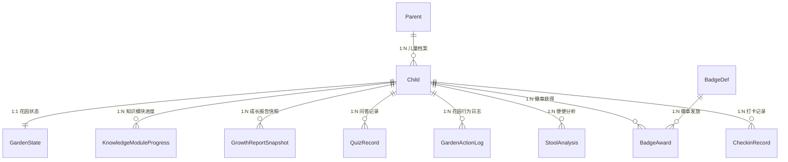

# 03-系统设计：肠道花园（Gut Garden）

> **版本**: v2.0
> **日期**: 2026-07-30
> **平台**: Phase 1 — Web 桌面端
> **团队**: 1 工程师 + 1 美工，2 周 sprint
> **来源**: [gut-garden_产品需求说明书.md](../20-prd/gut-garden_产品需求说明书.md)（含 2026-07-30 两轮澄清，共 10 个决策点）

---

## §1 架构总览

### 1.1 技术选型

| 层 | 选型 | 理由 |
| ---- | ---- | ---- |
| 前端框架 | **React 18 + TypeScript** | 生态成熟、组件化适合花园交互 |
| 渲染方案 | **CSS 3D Transforms + 多层视差**（2D 伪 3D） | 2D 手绘素材通过 CSS `perspective` + `translateZ` + 多层视差模拟 3D 深度；探索花园页局部使用轻量 3D 角色（2-3 个核心角色），整体 2D 童话手绘风，无需 Three.js/WebGL |
| 2D 动效引擎 | **CSS Animation + Framer Motion** | 声明式 React 动画库，弹簧物理、手势拖拽、layout 动画；花园角色移动/弹跳/缩放 |
| 精灵动画 | **CSS `steps()` + `@keyframes`** 或 **Lottie** | 帧动画用 CSS sprite sheet + steps()；角色待机呼吸/庆祝特效等复杂动效导出为 Lottie JSON |
| 粒子特效 | **tsParticles** | 打卡成功星星、花园花粉飘浮、升级光效 |
| 拖拽交互 | **@dnd-kit + Framer Motion** | 食物拖入花园，磁性吸附 + 弹性回弹 |
| 微音效 | **Howler.js** | 花园环境音（溪流、鸟鸣）、打卡成功音效、徽章揭晓音效 |
| UI 组件库 | **Radix UI + Tailwind CSS** | 无样式组件基元 + 原子化 CSS，完全自定义视觉 |
| 状态管理 | **Zustand** | 轻量、TypeScript 友好，适合游戏化状态 |
| 后端框架 | **Node.js + Fastify** | 高性能、TypeScript 原生支持、插件生态 |
| 数据库 | **PostgreSQL** | JSON 字段支持、全文检索 |
| ORM | **Drizzle ORM** | 类型安全、轻量、migration 自动化 |
| AI 导览 | **OpenAI / Claude API** + 预设 FAQ 兜底 | 大模型直接可用，无需自训 |
| 便便照片分析 | **第三方 API**（调研 Dieta Health / alternative） | 已有成熟方案，仅注册用户可用 |
| 文件存储 | **本地磁盘 / S3 兼容存储** | MVP 可本地 |
| 缓存 | **Redis**（可选，MVP 可跳过） | 会话管理 |

### 1.2 系统分层

```
┌──────────────────────────────────────────────────┐
│                  浏览器 (Web Desktop)             │
│  ┌───────────────┐ ┌──────────┐ ┌──────────────┐ │
│  │   花园场景     │ │ 打卡页面  │ │  徽章页面    │ │
│  │ CSS 3D +      │ │ React UI │ │  React UI    │ │
│  │ Parallax 视差  │ │ + Tailwind│ │ + Tailwind  │ │
│  │ + Framer Motion│ │          │ │              │ │
│  └───────┬───────┘ └────┬─────┘ └──────┬───────┘ │
│          │               │               │        │
│  ┌───────┴───────────────┴───────────────┴──────┐ │
│  │              Zustand 状态管理                 │ │
│  │   gardenStore / checkinStore / badgeStore     │ │
│  │   + localStorage (游客数据持久化)            │ │
│  └──────────────────────┬───────────────────────┘ │
└─────────────────────────┼─────────────────────────┘
                          │ HTTP REST + SSE (AI 流式)
┌─────────────────────────┼─────────────────────────┐
│                   Fastify API                      │
│  ┌──────────┐ ┌──────────┐ ┌──────────────┐       │
│  │ 认证模块  │ │ 打卡模块  │ │  徽章模块    │       │
│  │ JWT Token│ │ CRUD+状态│ │  条件引擎    │       │
│  │ + 游客模式│ │ + 子项   │ │  6阶段+4类   │       │
│  └────┬─────┘ └────┬─────┘ └──────┬───────┘       │
│       │             │              │                │
│  ┌────┴─────────────┴──────────────┴───────┐       │
│  │  ┌──────────┐ ┌──────────┐ ┌──────────┐ │       │
│  │  │ 课堂模块  │ │ AI 模块  │ │ 报告模块  │ │       │
│  │  │ 5大知识   │ │ 7条风格  │ │ 12项指标  │ │       │
│  │  └──────────┘ └──────────┘ └──────────┘ │       │
│  └──────────────────┬──────────────────────┘       │
│  ┌──────────────────┴──────────────────────┐       │
│  │              Drizzle ORM                 │       │
│  └──────────────────┬──────────────────────┘       │
└─────────────────────┼─────────────────────────────┘
                      │
┌─────────────────────┼─────────────────────────────┐
│                PostgreSQL                          │
│  parents / children / checkin_records /            │
│  stool_analyses / badge_defs / badge_awards /      │
│  garden_states / knowledge_module_progress ...     │
└───────────────────────────────────────────────────┘
```

### 1.3 前端路由

| 路由            | 页面    | 说明                            | 游客可访问  |
| ------------- | ----- | ----------------------------- | ------ |
| `/`           | 首页    | 金刚区 4 按钮 + 花园背景 + 右侧 AI 边栏    | ✅      |
| `/garden`     | 探索花园  | 全屏 2D 花园交互 + 轻量 3D 角色（投喂、放大镜） | ✅      |
| `/classroom`  | 探索课堂  | 5 大知识模块卡片 + 翻转交互 + 问答         | ✅      |
| `/checkin`    | 每日打卡  | 3 主项任务 + 可选子项 + 打卡日历 + 便便图标选择 | ✅      |
| `/badges`     | 成长徽章  | 花园成长 6 阶段主线 + 4 类支线徽章墙        | ✅      |
| `/report`     | 成长报告  | 家长视图，12 指标仪表盘                 | ❌（需注册） |
| `/settings`   | 设置    | 儿童档案管理 + 时长限制 + 隐私            | ❌（需注册） |
| `/login`      | 登录/注册 | 手机号验证码登录                      | ✅      |
| `/onboarding` | 新用户引导 | 4 步引导遮罩（首次访问时触发）              | ✅      |

### 1.4 组件树（关键页面）

```
App
├── AuthProvider (JWT + 游客上下文)
├── OnboardingOverlay (4 步引导遮罩，首次触发)
├── Layout
│   ├── AISidebar (右侧 AI 边栏 — 菌小园常驻)
│   └── MainContent
│       ├── HomePage
│       │   ├── GardenBackground (2D 轻量背景)
│       │   ├── KingKongZone (4 金刚按钮)
│       │   └── AISidebar
│       ├── GardenPage
│       │   ├── GardenStage (CSS 3D 透视容器, perspective: 1200px)
│       │   │   ├── ParallaxLayer-Back  (天空/远山 — translateZ: -300px)
│       │   │   ├── ParallaxLayer-Mid   (蘑菇房/风车/溪流 — translateZ: 0)
│       │   │   ├── ParallaxLayer-Front (角色/食物/植被 — translateZ: 150px)
│       │   │   ├── Characters (MVP 2-3 核心角色 × Lottie, Framer Motion)
│       │   │   ├── FoodToolbar (底部食物选择栏)
│       │   │   ├── MagnifierOverlay (放大镜半透明遮罩)
│       │   │   └── ParticleLayer (tsParticles 花园花粉/星星)
│       │   └── GardenHUD (状态提示/科普卡片弹出)
│       ├── ClassroomPage
│       │   ├── ModuleCardGrid (5 大知识模块卡片)
│       │   ├── KnowledgeCard (翻转交互：正面插画/背面知识点)
│       │   └── QuizModal (3 种题型：单选/配对/排序)
│       ├── CheckinPage
│       │   ├── TaskList (3 主项 + 可选子项弹出)
│       │   ├── SubItemPicker (喝水/蔬菜/水果/户外/早睡 勾选)
│       │   ├── StoolIconSelector (便便图标选择模式 — 默认)
│       │   ├── StoolUpload (便便照片上传模式 — 注册用户)
│       │   ├── Calendar (月视图打卡日历 + 补签入口)
│       │   └── CelebrationModal (打卡成功动画)
│       ├── BadgePage
│       │   ├── GardenStageBar (花园成长 6 阶段主线进度)
│       │   ├── BadgeGrid (4 类支线徽章 × 铜/银/金)
│       │   ├── PendingBadges (待获得灰阶预览)
│       │   └── BadgeRevealModal (新徽章揭晓动画)
│       ├── ReportPage (家长视图，指标仪表盘)
│       └── SettingsPage (家长控制)
└── AIChatbot (菌小园 — 全局悬浮对话，7 条风格指南)
```

### 1.5 2D 伪 3D 花园实现原理

**核心思路**: 多层 2D 插画 + CSS 3D 透视 + 视差滚动，探索页局部用 Lottie 角色增强立体感。

```
                    用户视角（屏幕）
                         │
    ┌────────────────────┼────────────────────┐
    │  Layer 1: 前景     │ translateZ: 150px  │ ← 角色、食物道具、近处花草
    │                    │ 移动速度: 1.0x     │
    ├────────────────────┼────────────────────┤
    │  Layer 2: 中景     │ translateZ: 0      │ ← 蘑菇房、风车、溪流
    │                    │ 移动速度: 0.5x     │
    ├────────────────────┼────────────────────┤
    │  Layer 3: 远景     │ translateZ: -150px │ ← 远山、云朵
    │                    │ 移动速度: 0.2x     │
    ├────────────────────┼────────────────────┤
    │  Layer 4: 天空     │ translateZ: -300px │ ← 天空渐变、太阳
    │                    │ 移动速度: 0x       │
    └────────────────────┴────────────────────┘
```

**关键技术**:

| 效果 | 实现方式 | 代码要点 |
| ---- | -------- | -------- |
| 场景纵深感 | CSS `perspective: 1200px` + 各层 `transform: translateZ(n)` | 父容器设 perspective，子元素设不同 translateZ + scale 补偿 |
| 鼠标视差 | `onMouseMove` → 各层反向位移，速度系数不同 | `transform: translateX(Δx * speed) translateY(Δy * speed)` |
| 角色入场/退场 | Framer Motion `animate={{ x, y, scale, opacity }}` | 弹簧物理 `spring: { stiffness: 100, damping: 15 }` |
| 角色待机动画 | Lottie 循环 JSON 或 CSS `@keyframes scale` | 所有角色默认播放 breathing 循环 |
| 角色状态切换 | Lottie 切换或 CSS class 切换 | e.g. 菌小园 idle → worry 切换 Lottie JSON |
| 食物拖拽 | @dnd-kit `useDraggable` + Framer Motion `dragConstraints` | 拖拽区域限定、松手位置检测 |
| 食物投入动画 | Framer Motion `animate` 抛物线路径 + 缩放 | `x: [0, 200], y: [0, -100, 300]` |
| 溪流流动 | CSS `@keyframes` 无限水平位移 + `repeat` 背景 | `animation: flow 8s linear infinite` |
| 风车旋转 | CSS `@keyframes rotate` | `animation: spin 4s linear infinite` |
| 花园状态色调 | CSS `filter` 过渡 | healthy: none; high_sugar: hue-rotate(-10deg); dry: saturate(0.6) |
| 粒子漂浮 | tsParticles `loadFull` | 花园花粉粒子（小圆点、缓动、随机方向） |
| 庆祝特效 | Lottie JSON 全屏覆盖 | 打卡成功星星爆炸、徽章揭晓光效 |

**视觉风格**: 2D 手绘童话风 — 森林绿 #4E6A3E + 奶油米 #FFF9EF + 珊瑚粉 #F38D83

---

## §2 数据模型

### 2.1 实体关系图



### 2.2 数据库表设计

#### 表清单

| 表名 | 说明 | 预估数据量/用户 |
| ---- | ---- | --------------- |
| `parents` | 家长账号 | 1 行 |
| `children` | 儿童档案 | 1-3 行/家长 |
| `checkin_records` | 每日打卡记录（含子项） | 365 行/年/儿童 |
| `stool_analyses` | 便便分析记录（双模式） | ~200 行/年/儿童 |
| `badge_defs` | 徽章定义模板 | ~22 行（全局） |
| `badge_awards` | 用户徽章获得记录 | ~60 行/儿童 |
| `garden_action_logs` | 花园行为日志 | ~5000 行/年/儿童 |
| `garden_states` | 花园当前状态快照 | 1 行/儿童 |
| `knowledge_module_progress` | 知识模块学习进度 | 5 行/儿童 |
| `quiz_records` | 问答记录 | 365 行/年/儿童 |
| `growth_report_snapshots` | 成长报告周期快照 | 52 行/年/儿童 |
| `checkin_calendar` | 打卡日历缓存 | 365 行/年/儿童 |

#### 核心表 DDL

**parents** — 家长账号

| 字段 | 类型 | 说明 |
| ---- | ---- | ---- |
| id | BIGSERIAL PK | 主键 |
| phone | VARCHAR(20) UNIQUE NOT NULL | 手机号 |
| created_at | TIMESTAMP DEFAULT NOW() | 注册时间 |
| last_login_at | TIMESTAMP | 最后登录时间 |
| status | VARCHAR(10) DEFAULT 'active' | active/disabled |

**children** — 儿童档案

| 字段 | 类型 | 说明 |
| ---- | ---- | ---- |
| id | BIGSERIAL PK | 主键 |
| parent_id | BIGINT NOT NULL REFERENCES parents(id) | 所属家长（游客模式为 NULL） |
| nickname | VARCHAR(30) NOT NULL | 昵称 |
| age | SMALLINT NOT NULL CHECK (age BETWEEN 3 AND 10) | 年龄（扩展至 3-10 岁） |
| daily_limit_minutes | SMALLINT DEFAULT 30 | 每日使用时长限制 |
| avatar_url | VARCHAR(300) | 头像 URL |
| created_at | TIMESTAMP DEFAULT NOW() | 创建时间 |

> **来源需求**: PRD §2.1 用户画像（3-10 岁）、§2.2 权限矩阵（游客+注册双轨）

**checkin_records** — 每日打卡记录

| 字段 | 类型 | 说明 |
| ---- | ---- | ---- |
| id | BIGSERIAL PK | 主键 |
| child_id | BIGINT NOT NULL REFERENCES children(id) | 所属儿童 |
| checkin_date | DATE NOT NULL | 打卡日期 |
| task_garden | VARCHAR(10) DEFAULT 'pending' | 探索花园：pending/auto_done |
| task_eat | VARCHAR(10) DEFAULT 'pending' | 吃好：pending/done |
| task_eat_content | VARCHAR(100) | 动态任务文案 |
| task_eat_skipped | BOOLEAN DEFAULT FALSE | 是否被家长跳过 |
| task_eat_skip_reason | VARCHAR(30) | 跳过原因 |
| task_sleep | VARCHAR(10) DEFAULT 'pending' | 睡好：pending/done |
| sub_water | BOOLEAN DEFAULT FALSE | 附加子项：喝水 |
| sub_vegetable | BOOLEAN DEFAULT FALSE | 附加子项：蔬菜 |
| sub_fruit | BOOLEAN DEFAULT FALSE | 附加子项：水果 |
| sub_outdoor | BOOLEAN DEFAULT FALSE | 附加子项：户外活动 |
| sub_early_sleep | BOOLEAN DEFAULT FALSE | 附加子项：早睡 |
| completed_at | TIMESTAMP | 全部完成时间 |
| is_makeup | BOOLEAN DEFAULT FALSE | 是否为补签 |
| makeup_date | DATE | 补签对应原始漏签日期 |
| created_at | TIMESTAMP DEFAULT NOW() | — |
| UNIQUE KEY: (child_id, checkin_date) | | |

> **来源需求**: PRD §4.3 每日打卡（3主项+可选附加项）、澄清#3（正向强化+补签3次/月）

**stool_analyses** — 便便分析记录（双模式）

| 字段 | 类型 | 说明 |
| ---- | ---- | ---- |
| id | BIGSERIAL PK | 主键 |
| child_id | BIGINT NOT NULL REFERENCES children(id) | — |
| checkin_id | BIGINT REFERENCES checkin_records(id) | 关联打卡记录 |
| mode | VARCHAR(15) NOT NULL DEFAULT 'icon_selection' | icon_selection / photo_upload |
| stool_icon_type | VARCHAR(20) | 图标选择模式：Bristol 类型对应的图标编码 |
| image_url | VARCHAR(500) | 便便照片存储路径（photo_upload 模式） |
| bristol_type | SMALLINT CHECK (bristol_type BETWEEN 1 AND 7) | 布里斯托类型 |
| diagnosis | VARCHAR(100) | 饮食诊断 |
| task_suggestion | VARCHAR(100) | 生成的动态任务文案 |
| api_raw_response | JSONB | 第三方 API 原始响应（仅 photo_upload） |
| uploaded_at | TIMESTAMP DEFAULT NOW() | — |
| is_valid | BOOLEAN DEFAULT TRUE | 是否通过粪便识别验证 |
| expires_at | TIMESTAMP DEFAULT NOW() + INTERVAL '3 days' | 结果有效期 |

> **来源需求**: PRD §4.3 便便双模式（默认图标选择 local-first + 可选拍照上传需注册）、澄清#1

**badge_defs** — 徽章定义模板

| 字段 | 类型 | 说明 |
| ---- | ---- | ---- |
| id | BIGSERIAL PK | 主键 |
| code | VARCHAR(50) UNIQUE NOT NULL | 徽章编码（如 `persist_7d`） |
| name | VARCHAR(50) NOT NULL | 徽章名称 |
| category | VARCHAR(20) NOT NULL | 分类：persist/explore/learn/special |
| description | VARCHAR(200) | 徽章描述 |
| condition_rule | JSONB NOT NULL | 获取条件规则 |
| silver_rule | JSONB | 银级升级规则 |
| gold_rule | JSONB | 金级升级规则 |
| sort_order | SMALLINT DEFAULT 0 | 排序 |
| is_active | BOOLEAN DEFAULT TRUE | 是否启用 |

**badge_awards** — 用户徽章获得记录

| 字段 | 类型 | 说明 |
| ---- | ---- | ---- |
| id | BIGSERIAL PK | 主键 |
| child_id | BIGINT NOT NULL REFERENCES children(id) | — |
| badge_def_id | BIGINT NOT NULL REFERENCES badge_defs(id) | — |
| rarity | VARCHAR(10) NOT NULL DEFAULT 'bronze' | bronze/silver/gold |
| awarded_at | TIMESTAMP DEFAULT NOW() | 获得时间 |
| upgraded_at | TIMESTAMP | 升级时间 |
| event_id | VARCHAR(100) | 触发行为事件 ID（幂等键） |
| UNIQUE KEY: (child_id, badge_def_id, rarity) | | |
| UNIQUE KEY: (event_id, badge_def_id) | | |

**garden_states** — 花园当前状态

| 字段 | 类型 | 说明 |
| ---- | ---- | ---- |
| id | BIGSERIAL PK | 主键 |
| child_id | BIGINT UNIQUE NOT NULL REFERENCES children(id) | — |
| current_state | VARCHAR(20) DEFAULT 'healthy' | healthy/high_sugar/dry/recovering |
| moisture_level | SMALLINT DEFAULT 50 CHECK (moisture_level BETWEEN 0 AND 100) | 水分值 |
| growth_stage | SMALLINT DEFAULT 1 CHECK (growth_stage BETWEEN 1 AND 6) | 花园成长阶段（1=种子 2=幼苗 3=成长 4=丰收 5=大师 6=终极） |
| garden_xp | INTEGER DEFAULT 0 | 累计经验值 |
| unlocked_features | JSONB DEFAULT '[]' | 已解锁功能列表 |
| last_updated | TIMESTAMP DEFAULT NOW() | — |

> **来源需求**: PRD §4.4 成长徽章（6阶段花园成长主线替代Lv.1-10）、澄清#4

**garden_action_logs** — 花园行为日志

| 字段 | 类型 | 说明 |
| ---- | ---- | ---- |
| id | BIGSERIAL PK | 主键 |
| child_id | BIGINT NOT NULL REFERENCES children(id) | — |
| action_type | VARCHAR(30) NOT NULL | feed/explore/magnifier/treatment |
| action_detail | JSONB | 行为详情（投喂食物类型、点击区域等） |
| created_at | TIMESTAMP DEFAULT NOW() | — |
| INDEX: (child_id, created_at DESC) | | |
| INDEX: (child_id, DATE(created_at), action_type) | | |

**knowledge_module_progress** — 知识模块学习进度（新增）

| 字段 | 类型 | 说明 |
| ---- | ---- | ---- |
| id | BIGSERIAL PK | 主键 |
| child_id | BIGINT NOT NULL REFERENCES children(id) | — |
| module_code | VARCHAR(30) NOT NULL | 模块编码：fiber_square / ferment_workshop / scfa_spring / barrier_wall / eco_station |
| cards_unlocked | INTEGER DEFAULT 0 | 已解锁卡片数 |
| cards_total | INTEGER DEFAULT 5 | 该模块总卡片数 |
| quizzes_passed | INTEGER DEFAULT 0 | 通过测验数 |
| animation_watched | BOOLEAN DEFAULT FALSE | 是否观看过 90s 科普动画 |
| completed_at | TIMESTAMP | 全部完成时间 |
| UNIQUE KEY: (child_id, module_code) | | |

> **来源需求**: PRD §4.2 探索课堂（5大知识模块）、澄清#5

**quiz_records** — 问答记录

| 字段 | 类型 | 说明 |
| ---- | ---- | ---- |
| id | BIGSERIAL PK | 主键 |
| child_id | BIGINT NOT NULL REFERENCES children(id) | — |
| quiz_date | DATE NOT NULL | 问答日期 |
| module_code | VARCHAR(30) | 所属知识模块 |
| question_type | VARCHAR(20) NOT NULL | single_choice / pairing / ordering |
| question | VARCHAR(500) NOT NULL | 题目内容 |
| answer_correct | BOOLEAN NOT NULL | 是否答对 |
| created_at | TIMESTAMP DEFAULT NOW() | — |
| INDEX: (child_id, quiz_date) | | |

**growth_report_snapshots** — 成长报告周期快照

| 字段 | 类型 | 说明 |
| ---- | ---- | ---- |
| id | BIGSERIAL PK | 主键 |
| child_id | BIGINT NOT NULL REFERENCES children(id) | — |
| period_type | VARCHAR(5) NOT NULL | week/month |
| period_start | DATE NOT NULL | 周期起始 |
| period_end | DATE NOT NULL | 周期结束 |
| metrics | JSONB NOT NULL | 12 项指标值快照 |
| generated_at | TIMESTAMP DEFAULT NOW() | — |
| UNIQUE KEY: (child_id, period_type, period_start) | | |

**checkin_calendar** — 打卡日历缓存

| 字段 | 类型 | 说明 |
| ---- | ---- | ---- |
| id | BIGSERIAL PK | 主键 |
| child_id | BIGINT NOT NULL REFERENCES children(id) | — |
| calendar_date | DATE NOT NULL | — |
| status | VARCHAR(10) NOT NULL DEFAULT 'miss' | done/miss/makeup |
| sub_items_completed | SMALLINT DEFAULT 0 | 完成的附加子项数 |
| garden_icon | VARCHAR(30) | 当日花园状态小图标编码 |
| updated_at | TIMESTAMP DEFAULT NOW() | — |
| UNIQUE KEY: (child_id, calendar_date) | | |

---

## §3 API 接口设计

### 3.1 游客模式说明

游客使用 localStorage 存储数据，以下接口标注"需注册"的端点仅对已登录家长可用。游客可用的接口无需认证，但服务端不做数据持久化（仅返回计算/查询结果）。

### 3.2 接口清单

| 方法 | 路径 | 说明 | 权限 |
| ---- | ---- | ---- | ---- |
| POST | `/api/auth/send-code` | 发送手机验证码 | 公开 |
| POST | `/api/auth/login` | 验证码登录 | 公开 |
| GET | `/api/children` | 获取当前家长的所有儿童档案 | 家长 |
| POST | `/api/children` | 创建儿童档案 | 家长 |
| PUT | `/api/children/:id` | 更新儿童档案 | 家长 |
| GET | `/api/checkin/today?child_id=` | 获取今日打卡状态 | 家长 |
| POST | `/api/checkin/confirm-eat` | 确认"吃好"任务（含可选子项） | 家长 |
| POST | `/api/checkin/confirm-sleep` | 确认"睡好"任务（含可选子项） | 家长 |
| POST | `/api/checkin/toggle-sub-item` | 切换附加子项完成状态 | 家长 |
| POST | `/api/checkin/skip-eat-suggestion` | 跳过饮食建议 | 家长 |
| POST | `/api/checkin/makeup` | 补签历史日期（≤3次/月） | 家长 |
| GET | `/api/checkin/calendar?child_id=&month=` | 获取打卡日历 | 家长 |
| POST | `/api/stool/select-icon` | 便便图标选择记录（双模式之本地模式） | 游客/家长 |
| POST | `/api/stool/upload` | 上传便便照片（需注册） | 家长 |
| GET | `/api/stool/analysis/:id` | 获取分析结果 | 家长 |
| GET | `/api/stool/latest?child_id=` | 最新分析结果 | 家长 |
| GET | `/api/badges/awarded?child_id=` | 已获得徽章列表 | 游客/家长 |
| GET | `/api/badges/pending?child_id=` | 待获得徽章列表（含进度） | 游客/家长 |
| GET | `/api/badges/defs` | 徽章定义全量 | 公开 |
| GET | `/api/garden/state?child_id=` | 花园当前状态 | 游客/家长 |
| POST | `/api/garden/log-action` | 记录花园行为 | 游客/家长 |
| GET | `/api/garden/actions/today-count?child_id=` | 今日花园交互次数 | 系统 |
| GET | `/api/classroom/modules?child_id=` | 获取 5 大知识模块及进度 | 游客/家长 |
| GET | `/api/classroom/modules/:code/cards` | 获取某模块知识卡片列表 | 游客/家长 |
| POST | `/api/classroom/quiz/answer` | 提交问答答案 | 游客/家长 |
| GET | `/api/report/weekly?child_id=&week=` | 周度成长报告 | 家长 |
| GET | `/api/report/monthly?child_id=&month=` | 月度成长报告 | 家长 |
| POST | `/api/ai/chat` | AI 导览对话（SSE 流式，7条风格指南） | 公开 |
| GET | `/api/ai/faq` | 预设 FAQ 列表 | 公开 |

### 3.3 核心接口示例

**POST /api/checkin/confirm-eat**

```json
// Request
{
  "child_id": 1,
  "confirmed": true,
  "sub_items": ["water", "vegetable"]
}
// Response
{
  "code": 0,
  "data": {
    "checkin_id": 42,
    "task_eat": "done",
    "sub_items_completed": 2,
    "bonus_xp": 4,
    "all_completed": false,
    "remaining_tasks": ["sleep"]
  }
}
```

**POST /api/stool/select-icon**

```json
// Request
{
  "child_id": 1,
  "stool_icon_type": "type_4_banana",
  "bristol_type": 4
}
// Response
{
  "code": 0,
  "data": {
    "analysis_id": 15,
    "mode": "icon_selection",
    "bristol_type": 4,
    "diagnosis": "香蕉便 — 非常健康！",
    "task_suggestion": "继续保持均衡饮食～"
  }
}
```

**GET /api/classroom/modules?child_id=1**

```json
{
  "code": 0,
  "data": [
    {
      "module_code": "fiber_square",
      "name": "膳食纤维广场",
      "description": "了解膳食纤维如何喂养肠道居民",
      "cards_unlocked": 3,
      "cards_total": 5,
      "animation_watched": true,
      "completed": false
    }
  ]
}
```

**GET /api/badges/pending?child_id=1**

```json
{
  "code": 0,
  "data": [
    {
      "badge_def_id": 3,
      "code": "persist_7d",
      "name": "一周之星",
      "category": "persist",
      "description": "连续打卡 7 天",
      "current_progress": 5,
      "target": 7,
      "progress_percent": 71,
      "silver_target": 30,
      "gold_target": 100,
      "image_url_bronze": "/assets/badges/persist_7d_bronze.png"
    }
  ]
}
```

---

## §4 业务行为与状态机

### 4.1 花园状态机

```
        ┌──────────────┐
        │   Healthy    │ ← 默认初始状态 (moisture: 40-60)
        │   (健康)     │
        └───┬────┬─────┘
            │    │
   投喂高糖  │    │  投喂干硬+缺水
            ▼    ▼
  ┌──────────┐  ┌──────────┐
  │HighSugar │  │   Dry    │
  │(高糖高脂)│  │ (干旱)   │
  └────┬─────┘  └────┬─────┘
       │              │
  投喂纤维+补水   补水达到阈值
       │              │
       ▼              ▼
  ┌──────────────────────┐
  │     Recovering       │
  │     (恢复中)         │
  └──────────┬───────────┘
             │ 水分平衡 + 排便动画
             ▼
        ┌──────────────┐
        │   Healthy    │
        └──────────────┘
```

### 4.2 花园成长阶段（6 阶段主线）

```
种子 (Stage 1) — 初始状态
  │ 累计完成 3 天打卡 + 投喂 10 次
  ▼
幼苗 (Stage 2) — 解锁第一个角色动画
  │ 累计完成 7 天打卡 + 投喂 30 次
  ▼
成长 (Stage 3) — 解锁放大镜功能
  │ 累计完成 21 天打卡 + 投喂 100 次 + 获得 3 枚徽章
  ▼
丰收 (Stage 4) — 解锁花园状态切换能力
  │ 累计完成 50 天打卡 + 投喂 200 次 + 获得 6 枚徽章
  ▼
大师 (Stage 5) — 解锁全角色 + 全部知识模块
  │ 累计完成 100 天打卡 + 投喂 500 次 + 获得 10 枚徽章
  ▼
终极 (Stage 6) — 花园完全体（金边特效）
```

> **来源需求**: PRD §4.4 成长徽章（融合方案：6阶段替代Lv.1-10）、澄清#4

### 4.3 徽章条件检测流程

```
用户行为事件 (checkin.completed / garden.action / quiz.answered / stool.recorded)
    │
    ▼
BadgeConditionEngine.evaluate(event)
    │
    ├── 查询所有 badge_defs WHERE is_active = true
    ├── 对每个 badge_def:
    │   ├── 检查 condition_rule.type 是否匹配 event.type
    │   ├── 查询该 child 的相关聚合数据 (累计天数/投喂数等)
    │   │   **正向强化**: 连续天数取 "历史最高" 而非 "当前"
    │   ├── 判断是否满足 condition_rule.threshold
    │   ├── 如满足且 badge_awards 中不存在 → 发放铜徽章
    │   ├── 如已获铜且满足 silver_rule → 升级为银
    │   └── 如已获银且满足 gold_rule → 升级为金
    │
    ▼
发放徽章 → 写入 badge_awards → 累积 garden_xp → 检查成长阶段升级 → 推送通知
```

> **来源需求**: PRD §4.4（正向强化：徽章只看累计，"最高连续天数"里程碑）、澄清#9

### 4.4 游客数据迁移流程（渐进注册）

```
游客使用 → 数据存 localStorage
    │
    │ 触发注册（便便拍照/创建档案/查看报告/跨设备同步）
    ▼
手机号验证码注册 → 创建 parent 记录
    │
    ▼
localStorage 数据迁移到后端:
  1. 花园状态 (garden_states) — moisture_level, growth_stage=1, xp
  2. 打卡记录 (checkin_records) — 从 localStorage 读取历史打卡日期
  3. 便便图标记录 (stool_analyses, mode=icon_selection)
  4. 徽章获得记录 (badge_awards)
  5. 知识模块进度 (knowledge_module_progress)
  6. 迁移完成后清除 localStorage 中的旧数据
```

> **来源需求**: PRD §2.2 权限矩阵（渐进注册触发点）、澄清#6

### 4.5 每日重置流程（服务端 cron，凌晨 00:00 UTC）

```
1. 对所有已注册 children，创建今日 checkin_records (status=pending)
2. 检查 stool_analyses 中 expires_at < NOW() 的记录 → 对应 children 的
   今日 checkin_records.task_eat_content 恢复为默认
3. 聚合昨日数据，生成增量 growth_report_snapshots (如为周期末)
4. 清理过期 token、临时文件
```

### 4.6 关键事务边界

| 操作 | 事务范围 | 说明 |
| ---- | -------- | ---- |
| 确认打卡任务 | 单条 UPDATE + 检查是否全部完成 + 子项加分 | 全部完成时触发徽章检测 |
| 便便照片分析回调 | INSERT stool_analyses + UPDATE checkin_records.task_eat_content | 原子操作 |
| 便便图标选择 | INSERT stool_analyses (mode=icon_selection) + 更新打卡状态 | 无需外部 API |
| 徽章发放 | INSERT badge_award + UPDATE garden_states.garden_xp | 经验值同步更新 |
| 补签 | INSERT checkin_record (makeup=true) + 重新计算连续天数 | 补签 ≤3次/月 |
| 花园成长阶段升级 | UPDATE garden_states.growth_stage + INSERT 解锁记录 | — |
| 游客数据迁移 | 批量 INSERT 多个表 + 清除 localStorage | 整体成功或回滚 |

---

## §5 徽章条件引擎规则表

### 5.1 条件规则定义

| 条件类型 | JSON 结构 | 示例 |
| -------- | --------- | ---- |
| `checkin_streak` | `{"type":"checkin_streak","threshold":7}` | 最高连续打卡 7 天 |
| `checkin_total` | `{"type":"checkin_total","threshold":30}` | 累计打卡 30 天 |
| `feed_total` | `{"type":"feed_total","threshold":50}` | 累计投喂 50 次 |
| `magnifier_use` | `{"type":"magnifier_use","threshold":20}` | 放大镜使用 20 次 |
| `quiz_correct` | `{"type":"quiz_correct","threshold":10}` | 累计答对 10 题 |
| `module_completed` | `{"type":"module_completed","module_code":"fiber_square"}` | 完成指定知识模块 |
| `stool_first` | `{"type":"stool_first"}` | 首次便便记录（含图标选择） |
| `perfect_week` | `{"type":"perfect_week"}` | 一周全勤（7/7） |
| `all_sub_items` | `{"type":"all_sub_items","threshold":7}` | 连续 7 天完成全部附加子项 |
| `birthday` | `{"type":"birthday"}` | 儿童生日当天登录 |
| `holiday` | `{"type":"holiday","holiday":"spring_festival"}` | 特定节日登录 |

> **正向强化原则**: `checkin_streak` 取"历史最高连续天数"，中断不降级、不标红。

### 5.2 MVP 徽章完整清单（18 枚 + 知识模块新增）

| code | 名称 | 分类 | 铜条件 | 银条件 | 金条件 |
| ---- | ---- | ---- | ------ | ------ | ------ |
| `first_checkin` | 初来乍到 | persist | 首次打卡 | — | — |
| `persist_3d` | 初露锋芒 | persist | 最高连续 3 天 | — | 最高连续 7 天 |
| `persist_7d` | 一周之星 | persist | 最高连续 7 天 | 最高连续 30 天 | 最高连续 100 天 |
| `persist_30d` | 月度冠军 | persist | 最高连续 30 天 | — | 最高连续 100 天 |
| `persist_100d` | 百日守护 | persist | 最高连续 100 天 | — | — |
| `first_feed` | 初次投喂 | explore | 首次投喂 | — | — |
| `feed_50` | 小小农夫 | explore | 累计 50 次 | 累计 200 次 | 累计 500 次 |
| `first_magnifier` | 小小科学家 | explore | 首次放大镜 | — | — |
| `magnifier_20` | 放大镜专家 | explore | 累计 20 次 | 累计 100 次 | — |
| `garden_doctor` | 花园医生 | explore | 完成 10 次恢复 | 完成 50 次 | — |
| `first_quiz` | 好奇宝宝 | learn | 首次问答 | — | — |
| `quiz_10` | 答题小能手 | learn | 答对 10 题 | 答对 50 题 | 答对 200 题 |
| `first_stool` | 便便观察员 | learn | 首次便便记录 | — | — |
| `stool_streak_7` | 持续观察 | learn | 连续 7 天记录 | 连续 30 天 | — |
| `type4_streak_5` | 超级便便 | special | 连续 5 次 Type 4 | 连续 15 次 | — |
| `perfect_week` | 完美一周 | special | 7 天全勤 | 4 周全勤 | — |
| `all_sub_7d` | 全能小冠军 | special | 连续 7 天全部子项 | 连续 21 天 | — |
| `module_fiber` | 纤维专家 | learn | 完成膳食纤维广场 | — | — |
| `module_all_5` | 知识全能王 | learn | 完成全部 5 个知识模块 | — | — |
| `birthday` | 花园生日 | special | 生日登录 | — | — |
| `spring_festival` | 春节彩蛋 | special | 春节期间登录 | — | — |

---

## §6 美术素材清单与命名规范

> **视觉风格**: 2D 手绘童话风 — 森林绿 #4E6A3E + 奶油米 #FFF9EF + 珊瑚粉 #F38D83
> **适用范围**: MVP Phase 1（Web 桌面端）
> **美工技能要求**: 2D 插画 + AE/Lottie 动效（无需 3D/Blender/Maya）
> **命名约定**: 全小写 + 下划线分隔，格式 `{类别}_{标识}_{状态/变体}.{格式}`
> **素材目录**: `/web/public/assets/{category}/`

### 6.1 角色素材（2D 插画 + Lottie 动效）

MVP 先做 5 个核心角色（菌小园、纤纤种子、杂草坏菌、丁丁泉灵、香蕉小船），其余延后。

| 角色 | MVP 静态图 | MVP Lottie | 延后 Lottie |
| ---- | ---------- | ---------- | ----------- |
| 菌小园 | ✅ | idle + happy + worry | — |
| 纤纤种子 | ✅ | idle + sad | — |
| 杂草坏菌 | ✅ | idle + rampant | — |
| 丁丁泉灵 | ✅ | idle + golden | hide |
| 香蕉小船 | ✅ | idle + sail | — |
| 风车蘑菇 | 延后 | 延后 | — |
| 云角马 | 延后 | 延后 | — |
| 虎宝 | 延后 | 延后 | — |

### 6.2 场景素材（2D 分层插画, PNG）

| 文件名 | 图层 | CSS 对应 | 画布尺寸 | 说明 |
| ------ | ---- | -------- | -------- | ---- |
| `scene_sky.png` | 天空层（Layer 4） | `translateZ: -300px` | 1920×1080 | 渐变天空 + 太阳/月亮 + 云朵 |
| `scene_far.png` | 远景层（Layer 3） | `translateZ: -150px` | 1920×1080 | 远山轮廓、远云朵（含透明通道） |
| `scene_mid.png` | 中景层（Layer 2） | `translateZ: 0` | 1920×1080 | 蘑菇房、风车塔、溪流、码头 |
| `scene_near.png` | 近景层（Layer 1） | `translateZ: 150px` | 1920×1080 | 前排花草、小石头、栅栏 |

花园状态变体：
- `scene_mid_healthy.png`（默认明亮配色）
- `scene_mid_high_sugar.png`（偏暗黄、溪流油污）
- `scene_mid_dry.png`（干涸、植被饱和度降低）

### 6.3 知识模块卡片素材（PNG 插画）

| 文件名 | 模块 | 说明 |
| ------ | ---- | ---- |
| `card_fiber_square.png` | 膳食纤维广场 | 纤维食物 + 肠道居民聚餐场景 |
| `card_ferment_workshop.png` | 发酵工坊 | 微生物工厂加工纤维 |
| `card_scfa_spring.png` | 短链脂肪酸泉 | 泉水滋养肠道屏障 |
| `card_barrier_wall.png` | 肠道屏障城墙 | 城墙保护示意图 |
| `card_eco_station.png` | 生态平衡观测站 | 花园生态全景监测 |

> **来源需求**: PRD §4.2 探索课堂（5大知识模块卡片系统）、澄清#5

### 6.4 素材汇总

| 类别 | 数量 | 格式 | 预估工时 |
| ---- | ---- | ---- | -------- |
| 角色静态图 | 5 张 | PNG | 1.5 天 |
| 角色 Lottie 动效 | 10 个 | JSON | 3 天 |
| 场景图层 | 7 张 | PNG | 2 天 |
| 食物道具 | 7 张 | PNG | 0.5 天 |
| 徽章图标 | ~35 张 | PNG | 3 天 |
| 知识模块卡片 | 5 张 | PNG | 1 天 |
| 科普动画 | 1 个（90s） | MP4/Lottie | 2 天 |
| UI 图标/素材 | ~22 个 | SVG/PNG | 1 天 |
| Lottie 庆祝特效 | 3 个 | JSON | 0.5 天 |
| **合计** | **~95 项** | — | **约 14.5 人天** |

### 6.5 2 周 sprint 素材优先级

| 优先级 | 内容 | 预计工时 | 交付截止 |
| ------ | ---- | -------- | -------- |
| **S1 必须** | 菌小园(1 PNG + 3 Lottie) + 纤纤种子(1 PNG + 2 Lottie) + 场景4层基础PNG + 速赢徽章 5 枚 + 首页/打卡UI | 6 天 | D5 |
| **S1 必须** | 食物道具(5 张) + 庆祝特效(3 Lottie) + 知识模块卡片(5 张) | 2.5 天 | D7 |
| **S2 必须** | 杂草坏菌(1+2) + 丁丁泉灵(1+2) + 香蕉小船(1+2) + 场景变体(3) | 3 天 | D10 |
| **S2 必须** | 剩余徽章(~30 张) + 科普动画(90s) + UI 补全 | 3 天 | D13 |
| **可延后** | 风车蘑菇/云角马/虎宝、节庆徽章 | — | V2 |

---

## §7 异常处理与错误码

### 7.1 错误码规范

格式: `{模块}_{三位序号}`

| 错误码 | 说明 | HTTP 状态 |
| ------ | ---- | --------- |
| `AUTH_001` | 验证码错误 | 400 |
| `AUTH_002` | 手机号未注册 | 404 |
| `AUTH_003` | Token 过期 | 401 |
| `CHILD_001` | 儿童档案不存在 | 404 |
| `CHILD_002` | 年龄超出范围 (3-10) | 400 |
| `CHECKIN_001` | 今日已打卡 | 409 |
| `CHECKIN_002` | 补签次数已用完 (3 次/月) | 403 |
| `CHECKIN_003` | 非当日不可打卡 | 400 |
| `CHECKIN_004` | 需家长验证 | 403 |
| `STOOL_001` | 图片非粪便内容 | 400 |
| `STOOL_002` | 图片过大 (>10MB) | 413 |
| `STOOL_003` | 分析服务超时 | 504 |
| `STOOL_004` | 分析服务不可用 | 503 |
| `STOOL_005` | 照片分析需注册账号 | 401 |
| `CLASSROOM_001` | 知识模块不存在 | 404 |
| `CLASSROOM_002` | 卡片未解锁 | 403 |
| `BADGE_001` | 徽章已获得（防重） | 409 |
| `GARDEN_001` | 交互频率过高 | 429 |
| `MIGRATE_001` | 游客数据迁移失败 | 500 |

---

## §8 2 周 Sprint 开发计划

### Week 1: 核心闭环

| 天 | 工程师 | 美工 | 交付物 |
| ---- | ------ | ---- | ------ |
| D1 | 项目脚手架（React+Vite）、数据库建表、游客模式 + 认证模块 | 角色概念设计（菌小园、纤纤种子）、场景草图 | 游客可用、DB ready |
| D2 | 花园场景渲染（CSS 3D + 4 层视差 + 鼠标视差）+ 角色系统 | 菌小园 3 Lottie + 纤纤种子 2 Lottie + 场景 4 层 PNG | 空花园可浏览 |
| D3 | 食物投喂系统（@dnd-kit + 抛物线 + 状态机）+ 放大镜 | 食物道具 PNG（5 张）+ 知识模块卡片（5 张） | 投喂交互可用 |
| D4 | 每日打卡页面（3 主项 + 子项弹出 + 便便图标选择 + 确认逻辑） | 打卡页 UI 素材 + 5 枚速赢徽章 + 便便图标（7 型） | 打卡 + 便便图标可用 |
| D5 | 打卡日历 + 正向强化连续/累计计数 + 补签 + 庆祝动画 | 庆祝特效 Lottie（3 个）+ 首页金刚区图标 | 打卡全流程 |
| D6 | AI 导览对话（7 条风格指南 + SSE 流式）+ 预设 FAQ | 菌小园对话头像 + FAQ 图标 | AI 导览可用 |
| D7 | 联调 + BugFix + Week 1 演示 | — | **Week 1 Demo** |

### Week 2: 完整体验

| 天 | 工程师 | 美工 | 交付物 |
| ---- | ------ | ---- | ------ |
| D8 | 探索课堂（5 模块卡片 + 翻转交互 + 3 种题型问答） | 科普动画（90s）+ 徽章图标（第 2 批） | 探索课堂可用 |
| D9 | 便便照片上传 + 第三方 API 对接（注册用户） | 便便上传 UI + 徽章图标（第 3 批） | 双模式便便闭环 |
| D10 | 徽章页面（6 阶段主线 + 4 类支线 + 条件引擎 + 正向强化） | 杂草坏菌 + 丁丁泉灵 + 香蕉小船 Lottie + 场景变体 | 徽章体系可用 |
| D11 | 花园成长阶段 + 成长报告页面（12 指标） | 阶段图标 + UI 补全 | 阶段 + 报告可用 |
| D12 | 设置页面 + 新用户引导（4 步遮罩）+ 游客数据迁移 | 引导遮罩 UI 素材 | 设置 + 引导可用 |
| D13 | 全量联调 + 边缘场景 + CSS 性能优化 | 素材精细调整 | 功能冻结 |
| D14 | 最终测试 + BugFix + Sprint Review | — | **MVP Release** |

---

## §9 测试场景

### 9.1 正常场景

| 场景 | 前置条件 | 操作 | 预期结果 |
| ---- | -------- | ---- | -------- |
| 游客首次使用 | 无账号 | 打开网站 → 浏览花园 → 投喂 → 选择便便图标 → 查看打卡 | 全部可用，数据存 localStorage，无任何注册提示阻断 |
| 首次打卡全流程（注册用户） | 已登录、已创建儿童档案 | 进入花园投喂 3 次 → 打卡页确认"吃好""睡好"→ 勾选子项"喝水""蔬菜" | 三项完成、子项 +4xp、庆祝动画、"初来乍到"+"初次投喂"徽章 |
| 便便图标选择 | 打卡页 | 选择 Type 4 图标 → 确认 | 记录保存、打卡状态更新、无需注册即可完成 |
| 便便照片分析→动态任务 | 已注册、当日"吃好"未确认 | 上传便便照片 → 等待分析 | "吃好"文案更新为建议、Bristol 类型展示 |
| 知识模块学习 | 已登录 | 进入探索课堂 → 点击"膳食纤维广场"→ 翻转 3 张卡片 → 完成问答 | 卡片解锁、问答记录保存、进度更新 |
| 花园成长阶段升级 | 种子阶段、累计 3 天打卡 + 10 次投喂 | 第 3 天完成打卡 | 阶段升级动画、解锁幼苗阶段新角色动画 |

### 9.2 异常场景

| 场景 | 前置条件 | 操作 | 预期结果 |
| ---- | -------- | ---- | -------- |
| 重复确认同一任务 | "吃好"已确认 | 再次点击确认 | 按钮置灰、Toast"已确认过啦～" |
| 上传非便便图片 | 已注册 | 上传风景照 | AI 返回 is_valid=false、"请上传便便照片" |
| 补签次数用完 | 本月已补签 3 次 | 尝试补签 | "本月补签次数已用完"、操作被拒绝 |
| 连续天数中断 | 连续打卡 5 天 → 漏 1 天 | 第 7 天打卡 | 显示"新的一轮开始了！"、最高连续记录保留、徽章/阶段不降级 |
| 便便分析 API 超时 | API 无响应 >30s | 上传照片 | 返回"菌小园今天有点累"降级文案、支持手动重试 |
| 游客触发注册功能 | 游客模式 | 点击"便便拍照分析"/"创建档案"/"查看报告" | 弹出注册引导、注册后自动迁移 localStorage 数据 |

### 9.3 边界场景

| 场景 | 前置条件 | 操作 | 预期结果 |
| ---- | -------- | ---- | -------- |
| 跨天零点边缘 | 23:59 开始打卡 | 00:01 完成最后一项 | 打卡记录归入昨日（服务端 UTC）、今日生成新记录 |
| 多孩切换 | 家长有 2 个儿童档案 | 切换当前儿童 | 数据完全隔离、各自独立 |
| 无便便分析数据时查看报告 | 新用户从未记录便便 | 打开成长报告 | 消化健康区显示"暂无数据"引导 |
| 年龄边界（3岁/10岁） | 创建儿童档案 | age=3 / age=10 | 创建成功、CHECK 约束通过 |
| 5 模块全部完成后 | 已完成全部知识模块 | 查看课堂页面 | 获得"知识全能王"徽章、所有卡片标记已完成 |
| localStorage 数据迁移冲突 | 游客已使用 7 天 → 注册新账号 | 注册 → 数据迁移 | 游客数据合并到新账号、无重复/丢失 |

---

## §10 设计决策记录

| 决策 | 选择 | 理由 |
| ---- | ---- | ---- |
| 渲染方案 | CSS 3D Transforms + 多层视差（2D 伪 3D） | 适配美工 2D 技能、GPU 合成层性能充裕、小程序迁移成本低 |
| 角色动效 | Lottie (AE → Bodymovin) + Framer Motion | 美工直接用 AE 做动画导出，无需学 3D 建模 |
| 视觉风格 | 2D 手绘童话风 #4E6A3E/#FFF9EF/#F38D83 | 澄清#2：整体 2D + 花园页轻量 3D 点缀 |
| 叙事隐喻 | 生态隐喻 — 肠道=花园、微生物=居民、食物=养分 | 澄清#5：完全切换为外部生态隐喻 |
| 便便分析 | 双模式 — 默认图标选择（localStorage）+ 可选照片分析（注册用户） | 澄清#1：零门槛默认 + 高级功能渐进升级 |
| 账号体系 | 游客默认（localStorage）+ 注册升级（触发于高级功能） | 澄清#6：降低首次使用门槛，注册率转化在刚需节点 |
| 目标年龄 | 3-10 岁，双阅读层级（家长深读 + 儿童简读） | 澄清#7：一套设计覆盖全年龄段 |
| 签到体系 | 3 主项（花园/吃好/睡好）+ 可选附加子项（5 项） | 澄清#3：核心 3 项简单明确，子项额外加分不强制 |
| 徽章体系 | 融合 — 6 阶段花园成长主线 + 4 类支线徽章 × 铜/银/金 | 澄清#4：主线清晰可感知 + 支线丰富可收集 |
| 正向强化 | 中断不惩罚/不降级/不标红，徽章看累计，里程碑取"历史最高" | 澄清#9：保护儿童心理安全感 |
| 补签机制 | 3 次/月安全网 | 澄清#9：温和兜底，不鼓励滥用 |
| AI 风格 | 7 条风格指南 + 菌小园人格 + 安全边界 | 澄清#10：确保 AI 输出安全可控 |
| 页面架构 | 桌面优先 — 金刚区 4 按钮 + 右侧 AI 边栏常驻 | 澄清#8：Phase 1 桌面 Web，移动端延至 Phase 2 |
| 知识模块 | 5 大模块（膳食纤维广场/发酵工坊/短链脂肪酸泉/肠道屏障城墙/生态平衡观测站） | 澄清#5：吸收外部内容规划体系 |
| 新用户引导 | 4 步遮罩引导流程 | 澄清#10：降低首次使用认知负荷 |
| 单人全栈 | Node.js 后端 | 同语言降低上下文切换成本 |
| 徽章条件引擎 | 事件驱动 + 规则配置 | 新增徽章改 JSON 配置即可 |
| 游客数据持久化 | localStorage（基础功能）/ PostgreSQL（注册后迁移） | 零门槛使用 + 注册后数据不丢失 |
| 成长报告聚合 | 每日凌晨批处理生成快照 | 避免实时扫全表，报告页面读快照秒开 |
| 美术素材 | PNG（角色/场景）+ Lottie JSON（动效）+ SVG（UI） | 美工无需 Blender/3D |
